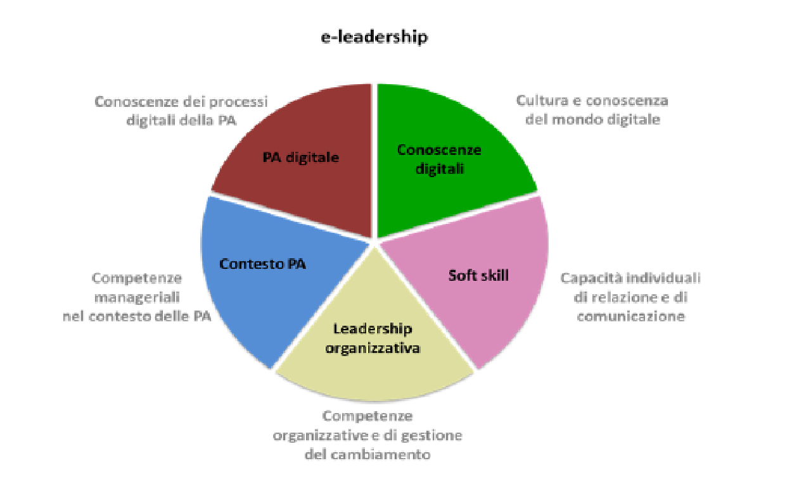

Linee guida per le competenze di e-leadership
=========================================================

*Competenze e strumenti per la valorizzazione della e-leadership nella
PA.*

Premessa 
-------------

Le competenze di e-leadership, o e-business, sono le capacità di
utilizzare al meglio le tecnologie digitali all’interno di qualsiasi
tipo di organizzazione e di introdurre innovazione digitale nello
specifico settore di mercato in cui si opera.

Le competenze digitali si integrano strettamente con le competenze
trasversali tipiche del leader e con le competenze specifiche di
settore. Esse includono anche le “competenze digitali per il lavoro”,
che devono essere possedute da tutti i lavoratori, poiché tutti i lavori
richiedono la capacità di utilizzare le tecnologie digitali.

Si tratta di competenze necessarie sia nel settore privato che nel
settore pubblico, entrambi in profonda trasformazione.

L’e-leader è in grado di sfruttare le tecnologie digitali per definire e
concretizzare progetti di innovazione digitale. La sua professionalità è
il risultato di un’integrazione continua di competenze apprese nei
percorsi formativi o acquisite nel percorso lavorativo.

I contenuti delle linee guida derivano dall’area di lavoro comune
“Competenze e strumenti per l’E-leadership”, del comitato OT11-OT2.

Il Comitato di Pilotaggio per il coordinamento degli interventi OT11
(rafforzamento della capacità istituzionale e amministrativa) e OT2
(attuazione dell’Agenda Digitale) è stato istituito allo scopo di
assicurare il presidio della strategia e la coerenza con i processi di
riforma della Pubblica Amministrazione.

La realizzazione di una strategia articolata di modernizzazione e
digitalizzazione del settore pubblico, attuata in tutto il territorio
nazionale e realizzata nel quadro di Programmi Operativi Nazionali e
Regionali, richiede, infatti un coordinamento che assicuri il
conseguimento dei risultati attesi attraverso la concentrazione delle
azioni verso obiettivi di cambiamento definiti e misurabili.

Con queste linee guida, sviluppate dall’Agenzia per l’Italia Digitale
(AgID), si vuole fornire un utile strumento per definire i principi e le
strategie per la mappatura e la valorizzazione degli e-leader, la
mappatura di possibili linee di intervento, la definizione di percorsi e
strumenti per la progettazione formativa nonché linee guida specifiche
per la misurazione di impatto.

Acronimi e abbreviazioni
~~~~~~~~~~~~~~~~~~~~~~~~~~~~~~~~

AgID Agenzia per l'Italia Digitale

CEN Comitato Europeo di Normazione

CNIPA Centro Nazionale Informatica Pubblica Amministrazione

DESI Digital Economy and Society Index

e-CF e-Competence Framework

EN Norma tecnica europea

ICT Information & Communication Technology

LCMS Learning Content Management System

MOOC Massive Open Online Courses

PA Pubblica Amministrazione

SNA Scuola Nazionale dell'Amministrazione

UNI Ente Nazionale di Normazione

Principi e strategie per la mappatura e la valorizzazione
----------------------------------------------------------------

Introduzione al tema dell’e-leadership
~~~~~~~~~~~~~~~~~~~~~~~~~~~~~~~~~~~~~~~~~~~~

Chi è l’e-leader? 
""""""""""""""""""""""""""""

L’e-leader è una figura professionale propulsiva che spinge le
organizzazioni verso l’innovazione e il cambiamento. Un e-leader può
avere responsabilità organizzative di vertice (può essere un manager in
una grande organizzazione, un dirigente in una pubblica amministrazione,
un imprenditore o una figura vicina all’imprenditore in una impresa) ma
può anche essere un livello professionale non di vertice purché in
possesso di adeguati poteri decisionali e comunque in grado di
migliorare la sfera d’azione del proprio lavoro, apportando un beneficio
a tutta l’organizzazione. La forte attitudine dell’e-leader a **“vedere”
il cambiamento** si traduce nella capacità di pensare e realizzare
progetti volti a superare i vecchi schemi mentali e ad innovare i
processi organizzativi.

L’e-leader come leva del cambiamento organizzativo 
"""""""""""""""""""""""""""""""""""""""""""""""""""""""""""

Come riesce l’e-leader a farsi leva del cambiamento organizzativo, senza
chiaramente prescindere dal coinvolgimento immediato e duraturo della
struttura amministrativa nel quale è inserito?

Con un bagaglio variegato di competenze e attitudini che vanno da
un’adeguata **cultura e conoscenza del mondo digitale**, alle ottime
**capacità individuali di relazione e di comunicazione**, alle
**competenze organizzative e di gestione del cambiamento**.

In più, calandosi nel mondo delle pubbliche amministrazioni, è
necessario che l’e-leader possegga una conoscenza profonda del contesto
organizzativo in cui opera e, nel nostro caso, delle competenze
approfondite sul funzionamento dei processi della PA per trasformarli in
senso digitale.

Quale percorso per l’e-leader? 
"""""""""""""""""""""""""""""""""""""""

L’e-leader è un professionista poliedrico e il suo profilo è il frutto
di una integrazione continua di competenze:

-  **Competenze formali:** apprese nella scuola e nell’università.

-  **Competenze non formali:** acquisite prevalentemente nel percorso
   lavorativo grazie a all'esperienza accumulata nella
   partecipazione/coordinamento di progetti di *digital transformation*
   e nel trasferimento di sapere volto all’azione.

-  **Competenze informali:** acquisite nella vita quotidiana, nel lavoro
   (non tramite azioni strutturate) e nella partecipazione a network
   professionali che promuovo l’innovazione digitale.

Il percorso verso l’e-leadership è lungo e articolato e necessita di
quella curiosità di qualunque cosa, di quella “marcia in più” per farsi
“motore del cambiamento”.

Per queste ragioni è molto più corretto parlare di percorsi di
“coltivazione” dell’e-leadership, piuttosto che di “formazione”
tradizionalmente intesa. In quest’ottica diventano rilevanti anche i
contesti di apprendimento informale nelle diverse fasi di vita di un
individuo, futuro e-leader: le attività di vita quotidiana legate ai
contesti di formazione, di lavoro e di vita fuori dal lavoro.

Le componenti dell’e-leadership 
"""""""""""""""""""""""""""""""""""""""

Possiamo riassumere le componenti essenziali dell’e-leadership (non
necessariamente in seno ad un unico individuo ma anche distribuite tra
un team) in 5 aree di competenza:

1. **Conoscenze digitali:** cultura e conoscenze del mondo digitale e
   dei sistemi ICT;

2. **Soft skill:** capacità (queste sì individuali) di relazione e di
   comunicazione;

3. **Leadership organizzativa:** competenze organizzative e di gestione
   del cambiamento;

4. **Contesto PA:** competenze gestionali nel contesto della pubblica
   amministrazione (in particolare la capacità di individuare trend e
   capire quali saranno le possibili applicazioni);

5. **PA digitale:** conoscenza dei processi digitali della pubblica
   amministrazione.

*Figura 1. Le cinque aree di competenza per l'e-leadership.*

Descrizione delle cinque aree di competenza
~~~~~~~~~~~~~~~~~~~~~~~~~~~~~~~~~~~~~~~~~~~~~~~~~~

La logica di fondo è che, a parte la prima area relativa alle conoscenze
digitali, le competenze per l’e-leadership siano sostanzialmente il
frutto di una revisione profonda delle competenze classiche di
leadership, reindirizzate e ristrutturate secondo la nuova ottica
richiesta dalla trasformazione digitale in atto.

Vediamo nel dettaglio le varie componenti del profilo di un e-leader.

Cultura e conoscenze del mondo digitale
""""""""""""""""""""""""""""""""""""""""""""""""

La prima componente essenziale per un e-leader è quella di possedere
un’adeguata cultura digitale supportata da un’ampia conoscenza sulle
possibilità di utilizzo delle tecnologie dell’informazione e della
comunicazione. Questa componente è indispensabile per la trasformazione
della figura di un leader in e-leader.

Le componenti più rilevanti di questa area di competenza sono le
seguenti:

-  **Digitale come fattore d’innovazione:** l’e-leader è consapevole
   delle potenzialità del digitale come leva per fare innovazione e
   ottimizzare i processi e i servizi, ma non è necessariamente uno
   specialista IT.

-  **Progetti di innovazione digitale:** conosce quali sono i principali
   processi, le metodologie e gli strumenti che caratterizzano lo
   sviluppo e la gestione dei progetti di innovazione digitale e le
   possibili fonti di finanziamento.

-  **Sicurezza IT:** è consapevole della rilevanza della sicurezza nelle
   organizzazioni e dei rischi associati. Conosce quali sono i
   principali strumenti organizzativi e tecnologici per la gestione
   della sicurezza.

-  **Il mondo delle applicazioni:** conosce quali sono le tipologie di
   applicazioni e di servizi applicativi sia di tipo tradizionale sia
   basate sulla rete ed i dispositivi mobili, orientate alle
   organizzazioni e alle reti sociali.

-  **Il mondo dei dati:** è consapevole del valore dei dati, delle
   informazioni e delle conoscenze nelle organizzazioni e conosce quali
   sono le principali tecnologie per la loro gestione e condivisione.

Capacità individuali di relazione e di comunicazione (“soft skill”)
""""""""""""""""""""""""""""""""""""""""""""""""""""""""""""""""""""""""""""""""

Le **competenze individuali** (chiamate anche "soft skill”) comprendono
un insieme di attitudini, atteggiamenti e capacità che hanno a che fare
con il modo di concepire il mondo, le organizzazioni e le relazioni con
gli altri.

È evidente che, in buona parte, le soft skill individuali fanno parte
del carattere e – assieme a propensioni strutturate nel tempo, quali le
capacità di gestione del gruppo e del lavoro in gruppo, o del conflitto,
la capacità di negoziazione e mediazione – attengono alle doti di
leadership, all’assertività, alla definizione del problema *(problem
setting)* e alla risoluzione del problema *(problem solving)*.

Altre competenze, invece, si possono affinare o, in qualche caso,
acquisire con un'adeguata formazione e, soprattutto, con l'esperienza:

-  la capacità di apprendere;

-  la capacità di adattarsi alle circostanze, senza perdere di vista il
   suo obiettivo;

-  la capacità di comunicare efficacemente;

-  la concezione del mondo come di un sistema complesso, in cui ogni
   elemento è collegato, direttamente o indirettamente, a tutti gli
   altri;

-  la capacità di "vedere" il futuro, prefigurandone l'evoluzione.

Competenze organizzative e di gestione del cambiamento 
""""""""""""""""""""""""""""""""""""""""""""""""""""""""""""""""

Le capacità organizzative – ovvero di pianificazione, programmazione,
progettazione, gestione delle risorse - sono quelle che caratterizzano
il leader all’interno di un gruppo formalizzato (come la pubblica
amministrazione, un’azienda o un’associazione) o informale.

Un leader non è un capo a cui, per un motivo o per l'altro, si deve
obbedienza: un leader viene innanzitutto riconosciuto come tale, perché
sa gestire il gruppo, sa valorizzare i propri collaboratori, sa
costruire reti di collaborazione anche (e soprattutto) all'esterno della
propria organizzazione.

Inoltre, sa indirizzare l'azione verso un obiettivo che tutti fanno
proprio. Lo fa condividendo la sua visione del futuro e del percorso che
porta al futuro. Coinvolge i suoi collaboratori in un'idea che non è
solo una speranza: si trasforma subito in una "stella polare" che indica
la strada in un progetto da portare avanti giorno per giorno.

Il vero leader è orientato al futuro. Ma per un e-leader l'orientamento
al futuro è, se possibile, ancora più pressante, perché il suo obiettivo
è un cambiamento che non riguarda solo l'esterno. E' un cambiamento,
basato sull'innovazione tecnologica, che coinvolge innanzitutto quelli
che lo promuovono.

La capacità richiesta all’e-leader è quella di costruire e governare il
percorso che consente il raggiungimento degli obiettivi delle azioni di
innovazione digitale, facendo sì che l’intera organizzazione sia
predisposta per favorirne il successo, entrambi operando efficacemente
nel contesto normativo e rendendo concreti e duraturi i risultati delle
innovazioni.

Per l’e-leader questo significa essere in grado di:

-  **Identificare opportunità di cambiamento e innovazione nei servizi e
   nei processi**, sulla base delle potenzialità offerte dalle diverse
   soluzioni applicative, per la gestione della conoscenza e dei dati
   (es. big data, open data).

-  **Identificare obiettivi e soluzioni progettuali innovative**, che
   non si limitino cioè a digitalizzare i flussi e i processi esistenti,
   che sono stati progettati pensando ad una organizzazione basata sulla
   produzione e lo scambio di documenti cartacei, ma tengano invece
   conto delle opportunità di innovazione che le potenzialità delle
   diverse soluzioni applicative possono offrire.

-  **Definire e pianificare le politiche e i processi**, con una forte
   attenzione alle opportunità offerte dalle tecnologie digitali,
   intervenendo sui processi per migliorare l’efficienza e l’efficacia,
   riorganizzandoli dove opportuno.

-  **Valutare le soluzioni tecnologiche migliori rispetto ai risultati
   di innovazione che si intende ottenere**, ottimizzando il rapporto
   tra efficacia (qualità del risultato) ed efficienza (tempi e costi).

-  **Gestire i canali di finanziamento e i processi di procurement e
   attivare progetti e iniziative che arricchiscano la qualità dei
   servizi**, anche attraverso processi di e-procurement trasparenti e
   aperti, utilizzando tutti gli strumenti disponibili per il
   procurement di servizi di innovazione digitale. E quindi anche
   sapersi avvalere del supporto di tecnici del software, avendo
   capacità critica e di interazione, per ben presentare le
   problematiche e saper contribuire all’individuazione delle soluzioni
   più efficaci.

-  **Ottimizzare il rapporto tempi / costo / qualità,** combinando in
   modo ottimale le risorse umane, tecnologiche e finanziarie per
   raggiungere i migliori risultati in termini di economicità e qualità,
   anche coordinando “team virtuali”, diffusi sul territorio, spesso
   multietnici e multiculturali, operando anche come mentore del
   personale connesso virtualmente.

Competenze sui processi digitali nella PA 
"""""""""""""""""""""""""""""""""""""""""""""""""""""

Per attuare la missione della PA e realizzare il cambiamento
conseguente, l’e-leader della PA deve possedere le conoscenze, le
competenze e le capacità tecnologiche, organizzative ed etiche
necessarie per programmare, prendere decisioni e agire al fine di
attuare la missione dell’amministrazione, così come definita in senso
ampio dalla legislazione di indirizzo per la pubblica amministrazione
(riforma della PA, CAD) e in senso stretto dalla strategia e dalla
missione della specifica amministrazione.

Questo richiede che l’e-leader sia in grado, in particolare, di:

1. **Tutelare la cittadinanza digitale:** assicurare il rispetto dei
   principi di cittadinanza digitale in modo inclusivo e diffuso,
   attivando tutte le iniziative utili a rendere i diritti di
   cittadinanza digitale effettivamente praticabili (identità digitale,
   privacy e sicurezza, accesso all’informazione)

2. **Realizzare progetti di e-government:** attivare all’interno della
   propria organizzazione progetti di innovazione (dematerializzazione,
   interoperabilità, infrastrutture tecnologiche) e riorganizzazione
   (reingegnerizzazione dei processi), migliorando le performance e
   l’efficienza con attenzione alla qualità e utilità dei risultati
   (definizione e implementazione di una Agenda Digitale regionale,
   progettazione e sviluppo di una Smart City, ecc.)

3. **Attivare processi di Open Government:** praticare la trasparenza
   (accesso alle informazioni e dati aperti), la partecipazione (ascolto
   e consultazione), la collaborazione e la accountability utilizzando
   la tecnologia come fattore abilitante per il rapporto con i cittadini
   e per l’efficacia dei processi di innovazione interna.

Si devono rafforzare le conoscenze e competenze su tutte le frontiere
dell’innovazione: cittadinanza digitale, eGovernment e Open Government.
Se l'obiettivo del leader è il cambiamento, l'innovazione, la
trasformazione dei processi e la messa in campo di nuovi servizi, non si
può immaginare che questo avvenga senza una conoscenza adeguata delle
potenzialità offerte dalle nuove tecnologie e dei vincoli che esse
pongono.

Nella tabella 1 si è cercato di effettuare una correlazione tra le
competenze per l’e-leadership e il framework e-CF 3.0 (norma tecnica UNI
EN 16234-1).

La norma UNI EN 16234-1 fornisce un riferimento di 40 competenze
richieste e praticate nel contesto lavorativo dell’Information and
Communication Technology (ICT); l’uso di un linguaggio condiviso per
descrivere competenze, skill e livelli di proficiency lo rende
facilmente comprensibile in tutta Europa. La norma fornisce un
linguaggio condiviso per la descrizione delle Competenze dei
Professionisti ICT, delle professioni e delle organizzazioni, ed è stato
pensato per soddisfare le necessità delle imprese e di altre
organizzazioni nel settore pubblico e privato.

**Tabella 1 – Correlazione tra competenze per l’e-leadership e e-CF 3.0
(UNI EN 16234-1)**

+-----------------------------------+-----------------------------------+
| Competenze per l’e-leadership –   | Competenze correlate a e-CF 3.0   |
| competenze sui processi digitali  | (UNI EN 16234-1)                  |
| nella PA                          |                                   |
+===================================+===================================+
| **Tutelare la cittadinanza        | -  A7. Monitoraggio dei Trend     |
| digitale **                       |    tecnologici                    |
|                                   |                                   |
| Assicurare il rispetto dei        | -  A9. Innovazione                |
| principi di cittadinanza digitale |                                   |
| in modo inclusivo e diffuso,      | -  D10. Gestione                  |
| attivando tutte le iniziative     |    dell’Informazione e della      |
| utili a rendere i diritti di      |    Conoscenza                     |
| cittadinanza digitale             |                                   |
| effettivamente praticabili        | -  D11. Identificazione dei       |
| (identità digitale, privacy e     |    Fabbisogni                     |
| sicurezza, accesso                |                                   |
| all’informazione).                | -  E5. Miglioramento del Processo |
+-----------------------------------+-----------------------------------+
| **Realizzare progetti di          | -  A.2. Gestione dei Livelli di   |
| e-government **                   |    Servizio                       |
|                                   |                                   |
| Attivare all’interno della        | -  A.6. Progettazione di          |
| propria organizzazione progetti   |    Applicazioni                   |
| di innovazione                    |                                   |
| (dematerializzazione,             | -  A.8. Sviluppo Sostenibile      |
| interoperabilità, infrastrutture  |                                   |
| tecnologiche) e riorganizzazione  | -  A9. Innovazione                |
| (reingegnerizzazione dei          |                                   |
| processi), migliorando le         | -  D.9. Sviluppo del Personale    |
| performance e l’efficienza con    |                                   |
| attenzione alla qualità e utilità | -  D12. Marketing Digitale        |
| dei risultati (definizione e      |                                   |
| implementazione di una Agenda     | -  E3. Gestione del Rischio       |
| Digitale regionale, progettazione |                                   |
| e sviluppo di una Smart City,     | -  E5. Miglioramento del Processo |
| ecc.)                             |                                   |
|                                   | -  E8. Gestione Sicurezza         |
|                                   |    dell’Informazione              |
|                                   |                                   |
|                                   | -  E9. Governance dei Sistemi     |
|                                   |    Informativi                    |
+-----------------------------------+-----------------------------------+
| **Attivare processi di            | -  A9. Innovazione                |
| OpenGovernment **                 |                                   |
|                                   | -  D12: Marketing Digitale        |
| Praticare la trasparenza (accesso |                                   |
| alle informazioni e dati aperti), |                                   |
| la partecipazione (ascolto e      |                                   |
| consultazione), la collaborazione |                                   |
| e la accountability utilizzando   |                                   |
| la tecnologia come fattore        |                                   |
| abilitante per il rapporto con i  |                                   |
| cittadini e per l’efficacia dei   |                                   |
| processi di innovazione interna.  |                                   |
+-----------------------------------+-----------------------------------+

Mappatura delle possibili linee di intervento sul tema
-----------------------------------------------------------

L’allargamento dei mercati, le innovazioni e la *digital transformation*
così come l’evidenza che la competizione tende a spostarsi dalle imprese
sino a investire il Sistema-Paese, ha reso indispensabile una
riconsiderazione del ruolo dell’amministrazione pubblica o meglio, più
correttamente, del complesso “sistema” delle pubbliche amministrazioni.

Ad oggi le organizzazioni della PA e le loro strutture, stanno
impattando con una gamma di strumenti e opportunità in un tempo talmente
breve da aver dovuto costruire un mondo di relazioni e competenze più in
funzione di un “adattamento” che di un vero approccio strategico.

Considerata la trasversalità di tale impatto, le strategie e competenze
richieste alla PA del presente prossimo dovranno, pertanto, essere
estese viralmente a tutti i soggetti compresi in tale ecosistema,
partendo dalle figure tradizionalmente apicali fino ad arrivare agli
uffici di front office (capillari nell’alveolo della governance), in cui
avvengono fattivamente gli scambi con cittadini e imprese.

Uno strumento per l’estensione di tali strategie e competenze potrebbe
ritrovarsi dei c.d. “Centri di competenza”, stabili e strutturati che
affiancano/supportano l'e-leader. Nei Centri di competenza sono presenti
team multidisciplinari che fanno trasferimento di conoscenza *(know
how)* continuo. È necessario acquisire competenze specialistiche che
difficilmente si trovano all'interno delle PA. È necessario comunque
valorizzare anche le professionalità già presenti nella PA con opportuni
incentivi.

In tal senso, l’esigenza di un recupero di efficienza ed efficacia del
sistema pubblico ha portato a una ridefinizione dei suoi confini e a una
nuova considerazione del rapporto pubblico-privato in termini di
cooperazione, nonché a predisporre le basi per un significativo
ripensamento dei suoi modelli organizzativi e funzionali alla ricerca di
forme di gestione più flessibili e più capaci anche di interagire.

Il percorso di ripensamento riguarda, tra l’altro, la semplificazione di
norme e procedure, ma soprattutto, l’orientamento alle imprese, al
cittadino e alla qualità del servizio, attestati dalla creazione di
strumenti quali lo sportello unico, le carte dei servizi, la
fatturazione elettronica e, da poco, il sistema di identità digitale
attraverso il quale si accederà ad una gamma di servizi sempre più ampia
che la PA potrà mettere a disposizione dell’utenza finale.

La sfida attuale da raccogliere si concentra, allora, sulla
trasformazione digitale che sta investendo gli operatori della Pubblica
Amministrazione, la società civile e imprenditoriale come una vera e
propria rivoluzione.

La missione inderogabile che la PA dovrà attuare è chiara ed evidente:
fornire servizi “on line” ai cittadini e al tessuto produttivo, pensando
non tanto all’ente erogatore, bensì alla sequenza degli eventi che
compongono la vita del cittadino e dell’impresa. Nascita, crescita, vita
o dipartita: in ciascuno di questi frangenti imprese e cittadini
richiedono servizi specifici che la PA, nel suo insieme, deve garantire
attraverso usabilità digitale e accesso multicanale.

Sviluppo della e-leadership per la PA
~~~~~~~~~~~~~~~~~~~~~~~~~~~~~~~~~~~~~~~~~~~~~~~~

I dirigenti della PA, per primi, sono destinatari delle iniziative di
alfabetizzazione digitale e, contemporaneamente, responsabili della loro
diffusione e del loro successo.

I 248 mila dirigenti della PA sono un target molto disomogeneo ed è
indispensabile definire attività specifiche che differenziano il tipo di
ruolo e il settore di attività. Una parte svolge attività di tipo
manageriale con responsabilità di risorse e di risultati all’interno di
organizzazioni complesse. Altri (docenti, magistrati, primari, …) hanno
ruoli dirigenziali più legati al presidio di alte competenze
specialistiche. Da ciò emerge la necessità di definire un processo
graduale che non crei resistenza nei dirigenti: il digital divide di una
parte di loro potrebbe rappresentare una barriera all'apprendimento; per
questo motivo sarebbe preferibile un avvicinamento graduale ai percorsi
di alfabetizzazione digitale.

La padronanza delle regole dell’amministrazione digitale deve essere
diffusa. Se da un lato è essenziale sapere dove le tecnologie possono
arrivare, ugualmente importante è sapere a quali condizioni possono
essere utilizzate: con quali vincoli, con quali procedimenti, con quali
precauzioni.

Le **soft skills** per il raggiungimento di tali obiettivi devono quindi
necessariamente comprendere:

-  **Intelligenza Emotiva.** Il “carisma” e la capacità di stimolare
   negli altri il bisogno di cambiamento e innovazione, impattando
   apparati e uffici spesso legati a procedure e ruoli ormai obsoleti

-  **Problem solving.** La capacità, nel rispetto della normativa, di
   individuare soluzioni rapide efficaci a problematiche e colli di
   bottiglia amministrativi

-  **Flessibilità.** Capacità di applicare le diverse best practice a
   contesti territoriali, sociali e lavorativi differenti

-  **Vision.** Visione prospettica di lungo termine capace di orientare
   percorsi di innovazione a efficientamento della P.A.

-  **Capacità di “ibridazione”.** La capacità di saper combinare,
   leggere e gestire le esigenze della gestione normativa e degli
   adempimenti della PA, coniugandoli con le necessità del mondo
   imprenditoriale, comprendendone il linguaggio e le esigenze
   gestionali.

Tra le competenze digitali (**hard skills**) che costituiranno
l’ossatura della cultura dell’E-leader della Pubblica Amministrazione
dovranno, pertanto, essere previste:

-  **Conoscenza di elementi di IT user-oriented (strumenti web di
   comunicazione, ricerca, gestione dati e informazioni)**, utili nella
   costruzione di relazioni con cittadino e impresa basate su principi
   di efficienza, trasparenza, accuratezza dell’informazione.

-  **Basi di Digital Transaction (strumenti di compravendita di servizi
   online, strumenti di pagamento online, strumenti di online
   finance)**, utili nella promozione di strumenti innovativi di
   transazione che facilitino processi “passivi” per l’impresa e i
   cittadini ma “attivi” per la P.A., nonché utili nella diffusione di
   strumenti di monitoraggio e prevenzione che diffondano concetti come
   la certezza della pena amministrativa e la capillarità dei controlli.

-  **Nozioni di online collaboration (strumenti collaborativi online,
   team management, supporto remoto)**, utili nella riduzione delle
   distanze fisiche e psicologiche tra impresa e P.A.

-  **Concetti sull’interoperabilità dei dati (Da dove vengono i dati? A
   cosa possono servire? Come renderli aperti e interoperabili?)**,
   utili alla diffusione e promozione di buone pratiche per
   l’innovazione e la crescita dei servizi e della competitività dei
   territori nonché alla autonomia dei soggetti nell’acquisizione
   dell’informazione (acquisire informazioni autonomamente, rielaborarle
   autonomamente, distribuirle nella società sotto forma di servizi a
   libero mercato).

-  **Conoscenza della normativa italiana e europea in materia di diritto
   dell'informatica,** attesa la complessità delle fonti che regolano
   ogni settore relativo ai servizi digitali offerti al territorio, alla
   identificazione elettronica e alle transazioni elettroniche, e alla
   gestione dell'attività delle pubbliche amministrazioni nella
   attuazione del principio del "digital first".

Alle profonde modificazioni interne che attengono alla PA – che da
principi gerarchici e dell’uniformità, si trasforma, nel tempo, in un
sistema complesso di tipo pluralistico - si aggiungono quelle
concernenti i suoi confini esterni, verso la società civile, che
diventano sempre più labili. Il rapporto con le imprese, in particolare,
di alcune “tipologie di PA” (vedi ad esempio, le Camere di commercio),
così come la comparsa di imprese e di enti di erogazione pubblici
pongono sempre più in discussione l’idea di una netta separazione tra
Stato e società, tra PA e impresa.

I servizi all’impresa, in particolare, richiedono una forte integrazione
tra le organizzazioni perché il servizio di per sé, anche quello più
semplice, chiama in causa enti diversi perché possa risultare compiuto.
Moltiplicare il numero dei servizi per il mondo delle imprese che
rispondano agli stessi criteri di fondo ovvero la trasversalità, la
cooperazione inter-istituzionale, l’integrazione inter-funzionale, il
controllo sull’output e, infine, la gestione dell’intero processo per
via telematica, significa “far cambiare pelle” al sistema organizzativo
della PA che interagisce con le imprese, mutarne le logiche del
coordinamento gerarchico, cambiarne i sistemi di regolazione e controllo
così come i sistemi di gestione del personale.

Significa dotarsi di figure capaci di “vedere” il cambiamento,
contestualizzato nelle organizzazioni in cui operano ma anche rispetto
ai processi dell’ente e alle risorse umane su cui possono contare,
consapevoli che dalla loro capacità di operare il cambiamento nelle loro
amministrazioni, contribuendo allo snellimento concreto degli
adempimenti burocratici, dando certezza dei tempi e rendendo accessibili
digitalmente servizi e informazioni, dipenderà la possibilità per la PA
di entrare a far parte della “catena del valore” dell’impresa,
diventando per estensione, sua partner nel miglioramento della
competitività.

Significa, quindi, dotarsi di e-leader, per i quali le conoscenze
fondamentali IT e i soft skills saranno bagaglio indispensabile. La
sfida che ci si trova ad affrontare è la necessità di far riflettere
assieme le diverse Amministrazioni perché, in un processo di cambiamento
che richiede l’integrazione delle organizzazioni, sono proprio gli
e-leader che dovranno operare quei cambiamenti necessari ad attuare la
strategia di integrazione e le modalità di regolazione delle conseguenze
organizzative.

Le relazioni con l’universo Impresa sono caratterizzate dalla natura e
dalle esigenze dei soggetti in essa presenti. Imprenditori, manager e
dipendenti agiscono sulla base del principio classico alla base di ogni
azienda: Massimo risultato con minimo “investimento”.

In quest’ottica azioni come l’informazione, la comunicazione e la
transazione verso questa tipologia di portatori di interessi dovranno
essere sempre orientate a massimizzare il valore estrinseco della
singola attività di relazione. La Pubblica Amministrazione deve
rappresentare e apparire come un organico apparato che, da un lato,
integra l’impresa nello svolgimento delle proprie attività (quasi) in
una logica di complementarietà, dall’altro la stimola, la supporta
nell’adempiere agli obblighi procedurali regolamentari e normativi.

Questa tipologia di approccio comporta necessariamente un cambio di
rotta nel concetto di gestione del servizio pubblico che deve partire
dall’utilizzo e diffusione di soft skills specifiche, tale vision, quasi
aziendale mira ad accelerare processi di efficientamento orientando
l’orizzonte dei servizi pubblici ad un’ottica user / customer oriented.

Obiettivo di tale azione, nel concreto, è favorire i processi in cui
l'osservanza delle norme (v. la richiesta di certificazione per
l’esportazione, la certificazione di sicurezza per lo svolgimento delle
attività interne) non rappresenta un mero adempimento normativo sofferto
e inutile, un collo di bottiglia, ma un'occasione di sviluppo per la
collettività, un'opportunità per l'impresa e un vantaggio per la
cittadinanza ed il mondo dell'impresa.

Percorsi e strumenti per la progettazione formativa
-------------------------------------------------------

Strumenti di attuazione
~~~~~~~~~~~~~~~~~~~~~~~~~~~~~~~~

L’e-leader deve avere una particolare attitudine a vedere il cambiamento
contestualizzato con i processi, con le risorse umane e, in generale,
con l’organizzazione in cui lavora. La costruzione di questa attitudine
è un percorso lungo, complesso e, in assenza di specifico talento, dal
successo non garantito, ma comunque richiede un percorso formativo
progettato e realizzato per costruire il patrimonio di conoscenza del
futuro e-leader.

Per creare le condizioni favorevoli, se non ottimali, perché nascano
figure di e-leader, in quantità e soprattutto qualità necessarie, si
deve avviare un processo di formazione continua che offre alla dirigenza
e al personale accesso alle basi fondamenti di cultura, conoscenze,
competenze utili, con la speranza che combinate con esperienza di lavoro
e buona vocazione possano generare e-leader.

Il processo formativo degli e-leader deve dimostrarsi all’altezza di un
ruolo di promozione e sostegno del cambiamento, a partire dall’aiuto che
deve dare agli attori in gioco per assolvere al loro ruolo nella nuova
prospettiva. La previsione di partnership pubblico-private finalizzate
al trasferimento continuo di know how tra il mondo privato e quello
pubblico potrebbe, nel medio periodo, portare a qualche significativo
passo in avanti su questo versante.

Non si tratta di approcciare, allora, la formazione per singola
organizzazione, ma per organizzazioni diverse assieme. La formazione
tradizionale che lavora sulla consapevolezza e sulle competenze deve
diventare formazione-intervento (progetto di ruolo), non svolta a
ridosso del cambiamento, ma per aiutare gli e-leader a gestire e ad
accompagnare il cambiamento.

La PA (o in una fase embrionale il gruppo degli aspiranti e-leader della
P.A.), potrà ri-costituirsi in una community digitale di innovazione in
cui i singoli, come cellule di un organismo, sono promotori di azioni,
approcci e best-practice che rappresentano il mutevole canovaccio su cui
ogni gruppo locale costruirà la propria linea di azione compatibilmente
con i topos culturali e sociali dello specifico contesto. La PA centrale
potrà promuovere questo approccio, demistificando la figura
ontologicamente inarrivabile del Guru digitale che divide, e premiando
l’iniziativa dei singoli come dei team di e-leader (tra più
organizzazioni), favorendo anche l’analisi dei contesti e il riutilizzo
di pratiche già sperimentate e in corso di sperimentazione.

Progettazione di attività formativa interna
~~~~~~~~~~~~~~~~~~~~~~~~~~~~~~~~~~~~~~~~~~~~~~~~~~~~~~~~

Le attività formative dovranno essere calibrate sulla base delle
competenze digitali già presenti e verificate all’interno dell’ente. Una
ottima iniziativa sarebbe quella di mappare le competenze esistenti
attraverso un percorso interno di analisi tramite assessment e di
monitoraggio dei vari livelli di competenze digitali esistenti e di
sviluppare con l’ausilio dell’ICT interno un percorso formativo
personalizzato.

Sulla base di alcune esperienze già esistenti nel panorama nazionale
questa mappatura consentirebbe di riconoscere i livelli di conoscenza
generali e di poter attivare una formazione ad hoc. I livelli di
competenze dovrebbero essere ricompresi negli standard esistenti e in
framework quali DIGCOMP per le competenze digitali di base ed e-CF 3.0
per quelle specialistiche, in modo da poter sviluppare percorsi di
aggiornamento costante e mirati con il conseguente aumento delle
competenze nei vari settori interni.

AgID, recependo quanto previsto dal piano "strategia per la crescita
digitale 2014-2020" e per coordinarne l'attuazione con tutte le
amministrazioni centrali e locali, nel mese di maggio 2017, a seguito
della consultazione pubblica ospitata sul sito open.gov.it, ha
provveduto ad sostituire il manuale operativo "Dizionario dei profili di
competenza per le professioni ICT" precedentemente pubblicato nel 2010
dal CNIPA, promuovendo l'uso del modello e-CF 3.0 e dei profili ad esso
correlati (profili di seconda e terza generazione). L’ultima versione di
tali linee guida è disponibile nella specifica sezione del sito
dell’AgID [1]_.

Nel 2017 è stato pubblicato l’aggiornamento del framework europeo
DigComp (DigComp 2.1: Il quadro di riferimento

per le competenze digitali dei cittadini - Con otto livelli di
padronanza ed esempi di utilizzo) con traduzione ufficiale in lingua
italiana a cura dell’AgID (maggio 2018) [2]_.

L’e-leader, interagendo laddove esistente con la direzione personale e
l'ufficio che si occupa di sviluppo delle competenze e formazione,
dovrebbe essere in grado di avviare questo tipo di attività quale
necessario punto di partenza per un corretto incremento di competenze
digitali tra i dipendenti. Tutte le attività della pubblica
amministrazione ormai non possono più prescindere dall’uso delle
tecnologie e i servizi offerti dalla pubblica amministrazione sono in
continua evoluzione anche grazie alla continua proliferazione di
normative e aggiornamenti delle stesse, e dunque si dovranno predisporre
corsi di formazione almeno semestrali per favorire il corretto operare
dei servizi di e-government ma anche di altri servizi che necessitano
però l’uso della rete. L’uso dello smart working, ad esempio, potrebbe
favorire le conoscenze informatiche ampliandole al contesto normativo
esistente, sempre attraverso l’uso di modelli formativi online quali
MOOC (Massive Open Online Courses, in italiano “Corsi online aperti su
larga scala”).

Tutti i servizi e le attività interne dovrebbero essere coinvolte in
modo attivo dando particolare risalto ai servizi interni che si occupano
dei servizi di e-government e di sportello, a chi si occupa di
trasparenza e a quelli che si occupano di performance, attivando
workflow e coordinandosi con il responsabile del settore ICT per
comprendere nel Piano di informatizzazione triennale dell’ente tutte
queste modalità di formazione del personale. Sarebbe importante poter
verificare le competenze acquisite anche attraverso dei test, e dunque
attivare dei percorsi di formazione assistita da parte del settore ICT
che potrebbe fungere da coordinatore delle proposte formative, sempre
attraverso la modalità MOOC o anche webinar on demand, con verifiche
programmabili attraverso dei questionari da predisporre online. Tutte le
attività di formazione e verifica potrebbero far anche emergere dei
patrimoni di competenze/conoscenze digitali utili all’ente nella
predisposizione di nuovi servizi digitali e/o miglioramento dei workflow
esistenti.

**Tabella 2 – Attività formative interne**

+-----------------------------------+-----------------------------------+
| Precondizione per la              | Obiettivo: Verifica delle         |
| realizzazione dell’attività di    | competenze digitali già presenti  |
| formazione interna                |                                   |
+===================================+===================================+
| Strumenti                         | -  Analisi dei fabbisogni;        |
|                                   |                                   |
|                                   | -  Monitoraggio dei vari livelli  |
|                                   |    di competenze digitali;        |
|                                   |                                   |
|                                   | -  Standard esistenti e in        |
|                                   |    framework quali DIGCOMP per le |
|                                   |    competenze digitali di base e  |
|                                   |    e-CF 3.0 per quelle            |
|                                   |    specialistiche;                |
+-----------------------------------+-----------------------------------+
| Unità responsabile                | Settore ICT, settore del          |
|                                   | personale e della formazione.     |
+-----------------------------------+-----------------------------------+
| Esito                             | Percorso formativo                |
|                                   | personalizzato.                   |
+-----------------------------------+-----------------------------------+

**Tabella 3 – Obiettivi perseguiti**

.. table:: Tabella 3 -

   +-----------------------------------+-----------------------------------+
   | Progettazione e avvio             | Obiettivo: Trasformazione         |
   | dell’attività formativa interna   | digitale della PA                 |
   +===================================+===================================+
   | Strumenti                         | -  Corsi di formazione almeno     |
   |                                   |    semestrali;                    |
   |                                   |                                   |
   |                                   | -  Smart working, per ampliare lo |
   |                                   |    spettro delle conoscenze       |
   |                                   |    informatiche estendendole per  |
   |                                   |    esempio al contesto normativo; |
   |                                   |                                   |
   |                                   | -  Modelli formativi online quali |
   |                                   |    MOOC, webinar on demand,       |
   |                                   |    comunità di pratica, world     |
   |                                   |    café, barcamp, mentoring,      |
   |                                   |    coaching, classi invertite;    |
   |                                   |                                   |
   |                                   | -  Verifiche programmabili con    |
   |                                   |    questionari online.            |
   +-----------------------------------+-----------------------------------+
   | Unità responsabile                | -  E-leader;                      |
   |                                   |                                   |
   |                                   | -  Coordinamento con il settore   |
   |                                   |    ICT;                           |
   |                                   |                                   |
   |                                   | -  Coinvolgimento di tutti i      |
   |                                   |    servizi e in particolare di    |
   |                                   |    quelli che si occupano         |
   |                                   |    e-goverment e di sportello, di |
   |                                   |    trasparenza e di performance.  |
   +-----------------------------------+-----------------------------------+
   | Esito                             | -  Attività formativa complessa   |
   |                                   |    inserita nel piano di          |
   |                                   |    informatizzazione triennale    |
   |                                   |    dell’ente;                     |
   |                                   |                                   |
   |                                   | -  Emersione di patrimoni di      |
   |                                   |    competenze/conoscenze digitali |
   |                                   |    standardizzate e certificabili |
   |                                   |    già presenti utili all’ente    |
   |                                   |    nella predisposizione di nuovi |
   |                                   |    servizi digitali e/o           |
   |                                   |    miglioramento dei workflow     |
   |                                   |    esistenti.                     |
   +-----------------------------------+-----------------------------------+

Progettazione di attività di formazione attraverso consulenze specialistiche
~~~~~~~~~~~~~~~~~~~~~~~~~~~~~~~~~~~~~~~~~~~~~~~~~~~~~~~~~~~~~~~~~~~~~~~~~~~~~~~~~~~

Le attività di formazione dovranno essere progettate e realizzate in
relazione allo specifico profilo degli e-leader, al mix di
conoscenze/competenze che sono state individuate in questo documento,
alla natura modulare dei percorsi e alla specifica coerenza rispetto
alle opportunità offerte dagli ambienti digitali di apprendimento e
lavoro collaborativo.

Nella costruzione dell’ambiente di apprendimento si potrà opportunamente
far ricorso, secondo lo schema già validato e rivelatosi efficace nei
progetti presentati nella Piattaforma della Coalizione per le competenze
digitali, ad una integrazione di diverse modalità:

1. Apprendimento autonomo, attraverso LCMS (learning content management
   system) specificamente predisposto per MOOC (Massive Open Online
   Courses) che prevedano Learning object, Videolezioni, Repertori
   documentali, test, con una struttura fortemente modulare. Questa
   parte della formazione è rivolta in modo particolare a favorire una
   crescita della “Cultura e conoscenza digitali” e alla diffusione
   delle competenze di base rispetto all’area dei “Processi digitali
   della PA”. In questi interventi formativi possono essere facilmente
   riutilizzati o lievemente aggiornati materiali o interi corsi
   modulari già realizzati e disponibili presso singole amministrazioni.

2. Apprendimento assistito, attraverso la costruzione di occasioni di
   incontro/confronto/condivisione delle conoscenze che possono essere
   realizzati sia mediante piattaforme online (webinar, attivazione di
   community) sia in incontri in presenza che vedano il coinvolgimento
   diretto degli stessi protagonisti della formazione (bar camp, world
   cafè) e siano finalizzati allo scambio di esperienze.

3. Apprendimento in presenza, riservato in particolare all’area delle
   soft skills, sia in relazione alla capacità di padroneggiare le
   dimensioni di interazione sociale e team building sia, più
   specificamente, per la socializzazione alle dinamiche di
   organizzazione e gestione del cambiamento. Una parte di queste
   competenze confluirà nella gestione dei project work di cui al
   successivo punto.

4. Apprendimento on the job, in cui le conoscenze e le competenze
   acquisite vengono condivise secondo una logia per-to-peer e
   valorizzate rispetto a specifici task. Dinamiche progettuali e
   operative di questo tipo possono essere opportunamente gestite
   attraverso un mix di attività online e attività in presenza e possono
   essere valorizzate nelle occasioni di confronto (bar camp).

Le quattro modalità precedentemente descritte possono essere affiancate
- se necessario - da specifiche forme di consulenza, anche
personalizzata ma continua e non saltuaria, rispetto a particolari
esigenze delle figure di e-leader nell’ambito dei diversi segmenti PA. I
percorsi sono sufficientemente omogenei per tutte le amministrazioni
rispetto al punto 1 e si differenziano progressivamente secondo le
specifiche esigenze nei punti 2, 3 e 4.

Progettazione di attività di formazione attraverso scambi tra Amministrazioni
~~~~~~~~~~~~~~~~~~~~~~~~~~~~~~~~~~~~~~~~~~~~~~~~~~~~~~~~~~~~~~~~~~~~~~~~~~~~~~~~~~~~~~~~

La costruzione dei percorsi formativi – sia promossi all’interno alle
singole amministrazioni che acquisiti a catalogo attraverso consulenze
esterne – deve essere effettuata in riferimento al profilo di e-leader e
in sostanziale coerenza rispetto al framework e-CF 3.0 “European
Competence Framework” sviluppato dal CEN (Comitato Europeo di
Normazione) diventato in Italia norma EN 16234-1, adottata assieme alle
norme che definiscono i profili professionali operanti nel settore ICT
dall’Agenzia per l’Italia Digitale [3]_. In questo contesto operativo,
costituiscono un valido esempio le iniziative promosse dalla SNA, sia
rispetto all’articolazione dei contenuti sia rispetto alla procedura di
conformità rispetto ai parametri e-CF.

È opportuno che le singole amministrazioni, nello sviluppo della loro
autonoma progettualità formativa, prendano in considerazione moduli già
disponibili a catalogo e rispondenti allo schema richiamato. Soprattutto
nella fase di apprendimento autonomo (MOOC, etc.) che riguarda
prevalentemente la crescita della cultura digitale e delle competenze di
base, possono essere facilmente riutilizzati o lievemente aggiornati
rispetto a specifiche esigenze materiali o interi corsi modulari già
realizzati e disponibili presso singole amministrazioni. Esistono già
dei contributi teorici e delle esperienze che parlano di replicabilità e
trasferibilità; è possibile anche creare dei protocolli con licenza
Xreative Commons.

Allo stesso tempo, considerando la natura modulare dei percorsi e la
loro rispondenza a parametri comuni (italiani e europei, attraverso e-CF
e DIGCOMP) è opportuno che le singole amministrazioni cooperino e si
coordino nelle fasi di nuova progettazione di moduli formativi,
condividano risorse formative di cui hanno formale titolarità, accolgano
personale di altre PA all’interno dei propri percorsi in modo da
ottimizzare la composizione delle aule e degli ambienti formativi e si
ottimizzino i costi sostenuti per ciascun utente del servizio. È
possibile anche immaginare, nell’ottica di un ri-uso ottimizzato, dei
meccanismi incentivanti da un punto di vista finanziario per chi mette a
disposizione quanto già progettato e testato, ovviamente previa
selezione.

Linee guida per la misurazione di impatto
---------------------------------------------

Il DESI (Digital Economy and Society Index) è l’indice elaborato dalla
Commissione Europea per valutare lo stato di avanzamento degli Stati
membri dell'UE verso un'economia e una società digitali attraverso
cinque indicatori:

-  connettività

-  capitale umano

-  uso di internet

-  integrazione della tecnologia digitale

-  servizi pubblici digitali.

Linee guida per la costruzione di un sistema di misurazione di impatto dell’e-leadership
~~~~~~~~~~~~~~~~~~~~~~~~~~~~~~~~~~~~~~~~~~~~~~~~~~~~~~~~~~~~~~~~~~~~~~~~~~~~~~~~~~~~~~~~~~~~~~~~

Gli indicatori da prevedere dovrebbero coprire quattro livelli di
impatto:

a) **macro** (soprattutto, indicatori DESI “allargato” sull’utilizzo dei
   servizi pubblici digitali);

b) **verticale** (declinati-desunti dall’e-leadership scoreboard e sugli
   indicatori della Coalizione);

c) **locale-specifico per area organizzativa, in termini di efficienza
   ed efficacia** (es. budget e raggiungimento obiettivi di
   performance);

d) **verticale-specifico sul processo adottato dagli interventi
   avviati**.

Naturalmente, dal punto d) al punto a) si riduce la forza dell’impatto
diretto degli interventi e aumenta la correlazione con altri fattori e
altri interventi. Soltanto però includendo tutti i livelli in un
cruscotto di misurazione si può osservare la coerenza dei miglioramenti
e la forza specifica degli interventi messi in atto, sapendo che il
cambiamento che si vuole ottenere non è da ricondurre al solo aumento
delle competenze.

Macro-impatti
"""""""""""""""""""""""""""

Rientrano qui le misurazioni di impatto, a livello regionale, rispetto
agli obiettivi principali dello sviluppo di competenze per
l’e-leadership nella PA:

1. alta qualità digitale dei servizi della PA;

2. elevato livello di fruizione dei servizi della PA;

3. efficienza dei processi della PA;

4. sviluppo dell’inclusione digitale;

5. attuazione dei principi dell’open government.

Possono essere utilizzati qui gli indicatori del cosiddetto “DESI
regionale”, cioè la declinazione a livello regionale degli indicatori
internazionali del DESI. Ad esempio:

-  livello di completezza online dei servizi;

-  percentuale di utilizzo dei servizi di e-government (con compilazione
   dei moduli);

-  percentuale di utenti internet regolari;

-  gap di genere utenti internet regolari;

-  percentuale di utenti internet regolari nelle categorie svantaggiate;

-  dataset pubblicati in formato aperto;

-  dipendenti PA formati su corsi di alfabetizzazione digitale avanzata.

Impatti verticali degli interventi
"""""""""""""""""""""""""""""""""""""""""""""

Rientrano qui le misurazioni di impatto, a livello di singola iniziativa
e/o regionale, rispetto alla diffusione di competenze per
l’e-leadership. Possono essere utilizzati gli indicatori definiti per la
Coalizione per le competenze digitali, oltre che tratti dalla
e-leadership scoreboard. Ad esempio:

1. Funzionari, manager pubblici coinvolti in percorsi di sviluppo di
   competenze e-leadership;

2. Lavoratori PA coinvolti in forme innovative di lavoro (smartworking,
   coworking);

3. Corsi online attivati per i lavoratori PA sull’e-leadership;

4. Lavoratori PA coinvolti in programmi di innovazione di
   prodotto/servizio o di processo;

5. PA che introducono innovazioni di prodotto/servizio o di processo;

6. Entità della spesa delle amministrazioni per R&D su programmi avviati
   dopo l’intervento.

Dall’e-leadership scoreboard:

-  Master/Exec Ed level programmes with a mix of ICT & business - - per
   100,000 population aged 20-59;

-  Employment in ICT intensive sectors - - as % of total employment.

Impatti locali sulle aree organizzative 
""""""""""""""""""""""""""""""""""""""""""""""""""""""

Rientrano qui le misurazioni di impatto, a livello di singola area
organizzativa interessata all’intervento e/o regionale. Possono essere
utilizzati indicatori di efficienza ed efficacia come:

-  rispetto del budget assegnato;

-  personale coinvolto nei piani di performance;

-  raggiungimento degli obiettivi di performance.

Impatti verticali-specifici
""""""""""""""""""""""""""""""""""""

Rientrano qui le misurazioni di impatto, a livello di singolo
intervento, in aggiunta agli indicatori di efficacia (sezione B).
Possono essere utilizzati indicatori trasversali di progetto come:

-  raggiungimento degli obiettivi di risultato;

-  rispetto dei tempi pianificati;

-  riusabilità dei risultati e dell’approccio.

.. [1]
   `http://www.agid.gov.it/agenda-digitale/competenze-digitali/competenze-specialistiche <http://www.agid.gov.it/agenda-digitale/competenze-digitali/competenze-specialistiche>`__

.. [2]
   `http://www.agid.gov.it/agenda-digitale/competenze-digitali/competenze-base <http://www.agid.gov.it/agenda-digitale/competenze-digitali/competenze-base>`__

.. [3]
   “Linee guida per la qualità delle competenze digitali nelle
   professionalità ICT” disponibili nel sito:
   http://www.agid.gov.it/agenzia/valutazione-e-monitoraggio/manuali-ict
