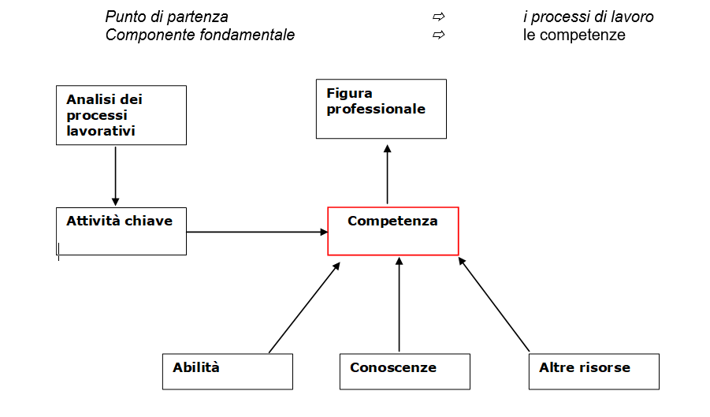
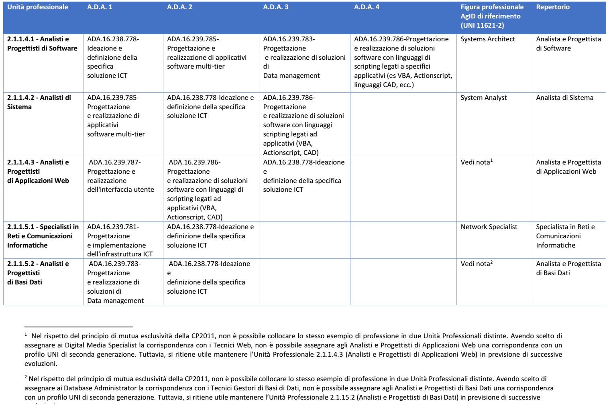

Modello di riferimento per la catalogazione
---------------------------------------------------

La coesistenza di diverse classificazioni rende complesso il procedimento di “unificazione”, ma al tempo stesso offre una ricchezza di prospettive che possono trovare in questa proposta una sintesi che coniughi esigenze diverse e individui un linguaggio comune.
Partendo dall’obiettivo di aggiornare il Repertorio Ligure si propone un processo sperimentale al fine di definire un “metodo” che consenta di rendere fruibili in modo omogeneo le diverse classificazioni.

L’obiettivo delle presenti linee guida è quello di supportare l’identificazione di un linguaggio che renda fruibili le classificazioni Istat e Atlante del Lavoro e delle Qualificazioni (Nazionale e repertori regionali), a partire dai profili UNI referenziati dalle linee guida AgID. In buona sostanza la proposta è quella di applicare un processo di “operativizzazione”, per passare dal concetto astratto di Figura professionale a quello concreto di attività (Area di attività dell’Atlante e Unità di competenza del repertorio) per poter descrivere con un linguaggio condiviso quali comportamenti (attività) vanno associati alla figura.

Attraverso la disarticolazione è possibile giungere ad una sintesi, di cui il prospetto allegato è un esempio. Il processo di operativizzazione:

1.	parte dall’attribuzione di una unità di analisi al concetto (quali attività chiave per quella figura);

2.	fornisce una definizione operativa (attribuisce una regola per la sua traduzione, ossia esplicita il risultato atteso di quella specifica competenza);

3.	definisce gli “indicatori”, nel nostro caso le Attività (Aree di Attività – Unità di Competenza) che compongono la figura.

Di seguito si riporta, a titolo esemplificativo, la descrizione del modello del Repertorio Ligure: dalla figura professionale si evidenzia come la centro sia il concetto di competenza, a sua volta articolata in conoscenze e abilità (che in prospettiva sono le variabili utilizzate per risalire alla competenza). Come noto, le figure professionali in generale, quelle dell’ICT in particolare, sono caratterizzate da una rapida evoluzione e modificazioni. Partire dai singoli “standard minimi di competenza” (le conoscenze e abilità) che compongono le competenze e quindi le qualificazioni consente di mantenere aggiornati in modo flessibile e mobile i descrittori delle figure professionali e soprattutto consente di collegare tra loro le diverse classificazioni.

Definizione di figura professionale
~~~~~~~~~~~~~~~~~~~~~~~~~~~~~~~~~~~~~~~~~~~

Le figure professionali descritte nel repertorio mirano a supportare le attività delle politiche di orientamento, formazione e lavoro e ad agevolare nella scelta dei percorsi formativi. È possibile consultare le schede, anche in formato PDF, delle diverse figure, in cui sono descritte le "situazioni tipo" di lavoro, le competenze, le conoscenze e le abilità connesse alle diverse professioni. È attivo anche il collegamento al Sistema Informativo Nazionale delle Professioni.

Rappresentano combinazioni di competenze che fanno riferimento a specifici processi produttivi, cioè a componenti relativamente stabili dell’organizzazione del lavoro. La figura professionale descrive nello stesso tempo:

•	i processi lavorativi e le attività che tipicamente sono svolte nei contesti di lavoro, al fine di raggiungere risultati economicamente rilevanti;

•	le risorse che le persone devono mobilitare per poter presidiare efficacemente le attività lavorative.
La figura professionale rappresenta la specifica combinazione di competenze che gli attori istituzionali riconoscono valida per agire all’interno di determinate posizioni Lavorative.

La figura professionale rappresenta la specifica combinazione di competenze che gli attori istituzionali riconoscono valida per agire all’interno di determinate posizioni Lavorative.

**Figura 1. Schema processi di lavoro-Competenze-Figura professionale**

Conoscenze, abilità e competenze
~~~~~~~~~~~~~~~~~~~~~~~~~~~~~~~~~~~~~~~~

Le figure professionali sono associate alla norma UNI EN 16234-1, contenente la versione in lingua italiana modello CEN e-Competence Framework (e-CF 3.0, divenuto nel 2016 uno standard europeo), che classifica 40 competenze in 5 aree di attività ICT. Il concetto chiave di questo modello è la competenza, definita come “La capacità dimostrata di applicare le conoscenze, gli skills e attitudini per ottenere risultati osservabili”. All'interno dell'e-CF, le competenze vengono descritte dal punto di vista del comportamento osservabile sul luogo di lavoro e degli elementi misurabili di una specifica competenza.

La competenza è un concetto duraturo che prescinde dalla tecnologia, dall'occupazione, dalla terminologia di marketing e dai concetti promozionali all'interno dell'ambiente ICT: sebbene queste variabili cambino rapidamente, il modello e-CF rimane duraturo e richiede manutenzione circa ogni tre anni per mantenere la rilevanza. Una competenza può essere una componente di un ruolo professionale, ma non può essere utilizzata per sostituire titoli di lavoro con lo stesso nome; ad esempio, la competenza, D.7. "Gestione vendite" non rappresenta il contenuto completo di un ruolo di lavoro "Responsabile vendite". Le competenze possono essere aggregate per rappresentare il contenuto essenziale di un ruolo o profilo professionale così come una singola competenza può essere assegnata a un numero di profili di lavoro diversi.

È utile sottolineare che la competenza e-CF non deve essere confusa con concetti di processo o tecnologici come "Cloud Computing" o "Big Data". Queste descrizioni rappresentano tecnologie in evoluzione e, nel contesto dell'e-CF, possono essere integrate come elementi all'interno di esempi di conoscenza e abilità.

L'e-CF non contempla ogni possibile competenza di un professionista ICT, ma prevede un modello classificatorio per definire le competenze associate alle figure professionali ICT. Alcune competenze introdotte nel modello e-CF (per esempio "Gestione dei problemi" o "Gestione dei rischi") sono comuni ad altre professioni, ma rappresentano un plus importante anche per le professioni ICT, che però esclude competenze generiche come può essere la "Gestione Generale".

Questo tipo di approccio è concettualmente diverso da quello utilizzato all'interno del modello Quadro europeo delle qualifiche e dei titoli per l'apprendimento permanente (EQF - European Quality Framework), che prevede uno schema per collegare i livelli di apprendimento e i quadri di qualifiche e descrive la competenza in termini di responsabilità e autonomia. Nell'e-CF i concetti di responsabilità e autonomia associati alle competenze non sono facilmente riutilizzabili a causa delle differenti definizioni da cui derivano i modelli (che comunque sono raccordati tra loro). La differenza sostanziale sta nel fatto che il modello e-CF “misura” esplicitamente il livello di una competenza (da 1 a 5) in termini di tre variabili: altezza (autonomia), profondità (complessità) e ampiezza (comportamento) per rappresentare il più fedelmente possibile la realtà del luogo di lavoro. In particolare, le competenze digitali sono riferite a 23 profili ICT collegati alla CP2011 e distribuiti in 6 differenti aree tematiche (Business management, Technical management, Design, Development, Service & Operation, Support). 

•	Le competenze sono costituite da un insieme integrato di conoscenze e capacità che assicurano l’esercizio di un comportamento organizzativo adeguato a produrre i risultati previsti da una specifica attività lavorativa. Le capacità sono intese come metodologie, tecniche, procedure, software, strumenti e attrezzature che il soggetto applica, utilizza, manovra, conduce. 

•	Le conoscenze sono intese come saperi in qualche modo formalizzati che il soggetto richiama alla memoria nell’atto di realizzare la prestazione lavorativa.

Identificazione delle componenti essenziali del modello
~~~~~~~~~~~~~~~~~~~~~~~~~~~~~~~~~~~~~~~~~~~~~~~~~~~~~~~~~~~~~~~

Prevedendo l’allineamento di quattro classificazioni (AgID, Istat, QNQ e Repertorio) e l’opportunità di creare una articolazione unica di competenze, è possibile utilizzare lo stesso linguaggio e consentire quindi di connettere le classificazioni delle figure professionali e delle qualificazioni correlate. Di seguito si propone la struttura di un modello condiviso per l’individuazione delle qualificazioni da certificare e delle relative competenze.

È importante, in un’ottica di mobilità europea, importante allineare le qualificazioni ICT al modello e-CF, per poter garantire una certa uniformità di linguaggio e una validità delle certificazioni più ampia e spendibile (vedi Allegato A). 

Struttura del modello
~~~~~~~~~~~~~~~~~~~~~~~~~~~~

Il modello proposto prevede:

1)	la comparazione tra le 13 UP della classificazione nazionale delle professioni, individuate come correlate alle figure ICT (contenute nelle norme UNI e recepite da AgID) e le singole ADA individuate nell’ambito della costruzione del QNQ. Da tale comparazione è possibile individuare quali attività sono attese nell’ambito di ciascuna UP e quali ADA sono collegate a più qualificazioni.

2)	La comparazione successiva, per ciascuna UP, con la figura professionale ICT AgID di riferimento.

3)	La comparazione, attraverso l’ADA correlata (o le ADA correlate) con le qualificazioni presenti nel Quadro Nazionale delle Qualificazioni e con i singoli Repertori Regionali.

Dal quadro emergente è pertanto possibile individuare sia le qualificazioni già presenti nel QNQ che nei singoli repertori ed individuare le qualificazioni da proporre per un inserimento, al fine di completare il QNQ con tutte le qualificazioni AgID. È utile evidenziare che:

A)	Nel caso in cui le qualificazioni siano presenti nei repertori, è necessario indicare, per ciascuna competenza, la corrispondenza con le competenze e-CF, specificandone il livello minimo.

B)	Nel caso in cui non siano presenti alcune o la totalità delle qualificazioni ICT, è consigliato inserire nei repertori le Unità Professionali relative alla CP2011 (indicate nel presente documento e già collegate ai profili AgID) e le competenze e-CF riportate nel quadro riassuntivo sottostante.

Di seguito un esempio di quadro sinottico realizzato con la comparazione dei profili (qualificazioni) presenti o in corso di costruzione nel Repertorio di Regione Liguria (le figure indicate con asterisco sono già presenti nel repertorio di Regione Liguria mentre le restanti sono in fase di costruzione).

Prospetto sinottico CP 2011 – ADA – AGID – Repertorio – Esemplificativo sul caso Liguria
"""""""""""""""""""""""""""""""""""""""""""""""""""""""""""""""""""""""""""""""""""""""""""""""""""

