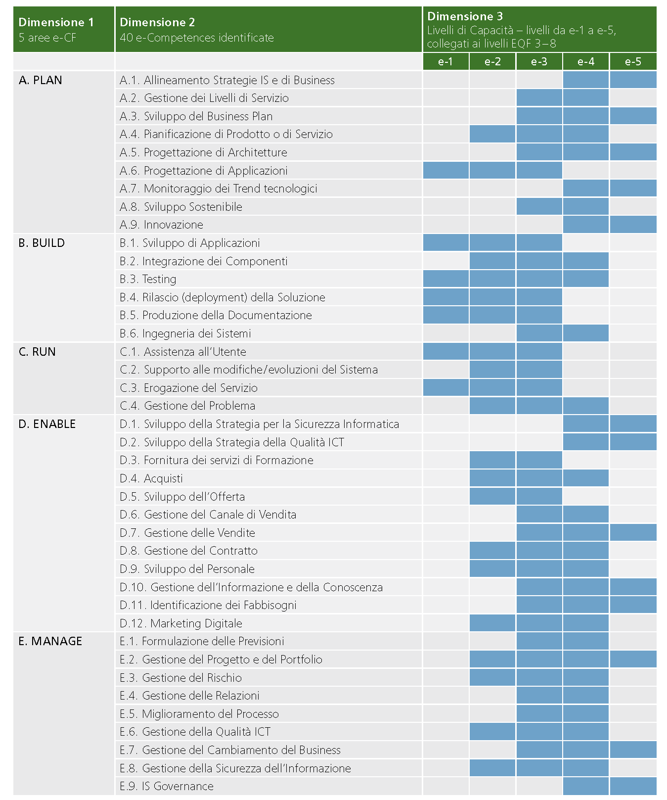
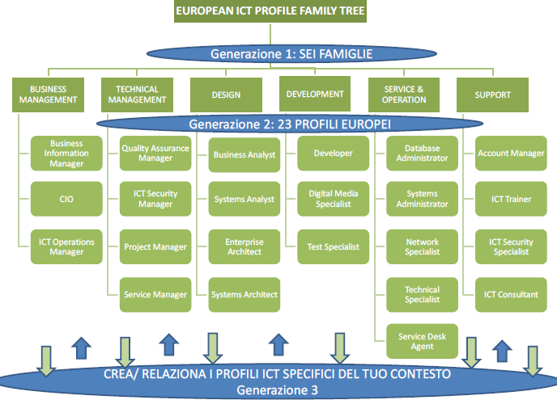

Profili di competenza
------------------------------

Le modalità di affidamento dei servizi ICT ad un Fornitore esterno sono
regolate da atti contrattuali il cui scopo principale è quello di
garantire al Cliente una qualità del servizio sufficiente a soddisfare
le esigenze precedentemente individuate. Nello schema proposto dalle
Linee guida, già richiamato nel capitolo introduttivo, spetta al
Fornitore il dimensionamento e la gestione delle risorse (tecniche,
strumentali ed ovviamente anche umane), necessarie all’erogazione del
servizio. Proprie del Cliente sono invece le attività di governo, come
il costante controllo che gli indicatori di qualità misurati non si
discostino da quelli concordati e, in caso contrario, nei vari
interventi di recupero.

In un contratto di servizio così concepito il Cliente, che ovviamente
conserva il diritto di sindacare qualunque scelta del Fornitore, anche
concernente le risorse umane, all’atto pratico potrebbe trovare più
conveniente, specialmente se non dispone di una sufficiente esperienza,
prevenire eventuali inefficienze, imponendo al Fornitore l’utilizzo di
personale di accertata competenza professionale.

Per la stesura di clausole contrattuali che abbiano tali finalità è
necessario descrivere le figure professionali richieste in modo
esauriente e non ambiguo ponendole in relazione al ruolo che dovranno
assumere nel gruppo di lavoro o modello di servizio del Fornitore.

È opportuno chiarire che la caratterizzazione di una figura
professionale, in ambito contrattuale, può essere logicamente scomposta
in due componenti. La prima, che comprende le connotazioni di carattere
più generale sarà definibile in modo indipendente dal ruolo che dovrà
effettivamente essere assunto in una particolare fornitura. Ci
riferiremo d’ora in avanti a questa componente con il termine “Profilo
di competenza”, intendendo specificamente con questo:

-  le competenze possedute, ovvero l’abilità di portare a termine un
   insieme determinato di compiti tecnici o manageriali;

-  le conoscenze possedute, di supporto allo svolgimento dei compiti
   richiesti;

-  i ruoli (insieme di specifiche attività e/o responsabilità) che
   tipicamente possono essere coperti;

-  le attitudini possedute, che facilitano l’assunzione di comportamenti
   adeguati al ruolo.

La seconda componente, influenzata fortemente dalla particolare
fornitura in oggetto, non può essere trattata in modo generale. Essa si
connota, per esempio, attraverso il patrimonio di concrete conoscenze
riguardanti specifiche tecnologie e/o metodologie, oltre che in
comprovate esperienze pregresse espletate in ambiti determinati. Tali
caratterizzazioni evidentemente definiscono un curriculum vitae ideale
comprendendo aspetti quali:

-  istruzione e formazione, ovvero l’insieme di titoli di studio,
   abilitazioni e certificazioni possedute;

-  esperienze professionali intese come specifiche fattive attività
   espletate all’interno di organizzazioni in un ruolo definito e legato
   a specifiche responsabilità, eventualmente per conto di identificati
   clienti esterni;

-  anni di esperienza ricoperti nei diversi ruoli.

In questo capitolo ci limiteremo a definire un modello descrittivo dei
profili di competenza delle figure professionali ICT, disinteressandoci
totalmente dei dati curricolari. Per la descrizione delle competenze ICT
è stata adottata la stessa classificazione operata dal riferimento
europeo contenuto nella norma UNI EN 16234-1 "e-Competence Framework",
utilizzandone la traduzione in lingua italiana.

Modello e-CF 3.0 (UNI EN 16234-1)
~~~~~~~~~~~~~~~~~~~~~~~~~~~~~~~~~~~~~~~

La norma UNI EN 16234-1 fornisce un riferimento di 40 competenze
richieste e praticate nel contesto lavorativo dell’Information and
Communication Technology (ICT); l’uso di un linguaggio condiviso per
descrivere competenze, skill e livelli di proficiency lo rende
facilmente comprensibile in tutta Europa. La norma fornisce un
linguaggio condiviso per la descrizione delle Competenze dei
Professionisti ICT, delle professioni e delle organizzazioni, ed è stato
pensato per soddisfare le necessità delle imprese e di altre
organizzazioni nel settore pubblico e privato.

La norma UNI EN 16234-1 offre una definizione chiara ed una guida sicura
a supporto delle decisioni sia nel processo di selezione e reclutamento
dei candidati, sia in quello di assessment e formazione di
professionisti ICT. La norma UNI EN 16234-1 rende possibile
l’identificazione di skill e competenze che possono essere richieste per
svolgere correttamente un compito nell’ambito di una responsabilità
assegnata. Una sua adozione diffusa da parte di aziende ed
organizzazioni Europee aumenterà la trasparenza, la mobilità e
l’efficienza nella gestione risorse umane del settore ICT.

L’ e-Competence Framework 3.0 (UNI EN 16234-1) è strutturato in quattro
dimensioni. Queste dimensioni riflettono differenti livelli di requisiti
di business e di pianificazione delle risorse umane e integrano delle
linee guida per la definizione dei livelli di abilità lavorative. Le
dimensioni sono così strutturate:

-  Dimensione 1: 5 aree di e-Competence, derivate dai processi business
   dell’ICT: PLAN (PIANIFICARE) - BUILD (REALIZZARE) – RUN (OPERARE) –
   ENABLE (ABILITARE) – MANAGE (GESTIRE).

-  Dimensione 2: Un insieme di e-Competence di riferimento per ciascuna
   area, con una descrizione generica per ciascuna competenza. Le 40
   competenze identificate in totale forniscono le definizioni di
   riferimento dell’e-CF 3.0.

-  Dimensione 3: Livelli di Capacità per ciascuna e-Competence: sono
   articolati in Livello di e-Competence da e-1 a e-5, e messi in
   relazione con i livelli EQF da 3 a 8.

-  Dimensione 4: Esempi di knowledge (conoscenza) e skill (capacità):
   sono in relazione alla dimensione 2 della e-Competence. Tali esempi,
   descrivono il contesto aggiungendo valore al framework e comunque non
   devono ritenersi esaustivi.

Mentre le definizioni delle competenze sono esplicitamente assegnate
alle dimensioni 2 e 3 e gli esempi di knowledge e skill sono presenti
nella dimensione 4 del framework, le attitudini sono inserite in tutte e
tre le dimensioni.

**Figura 1. European e-Competence Framework versione 3.0 visione di
insieme.**

**I principi guida di e-CF**

-  **e-CF è un abilitatore**; è stato progettato per essere uno
   strumento di empowerment per gli utenti, e non per definire alcun
   tipo di restrizione. L’e-CF fornisce una struttura e dei contenuti
   applicabili a differenti attori: società che operano nel settore
   privato e pubblico, società utenti e fornitrici di ICT, istituzioni
   ed associazioni che si occupano di istruzione, di formazione e di
   certificazione, partner sociali e professionisti. In questo ampio
   contesto, l’e-CF è pensato per sostenere la comprensione, non per
   rendere obbligatorio l’uso di ogni termine utilizzato dentro il
   framework.

-  **L’e-CF definisce** la competenza ICT come “una abilità dimostrata
   di applicare conoscenza (*knowledge*), abilità (*skill*) e attitudini
   (*attitude*) per raggiungere risultati osservabili”. Questo è un
   concetto olistico direttamente connesso con le attività praticate sul
   posto di lavoro che comprendono comportamenti umani complessi
   espressi e incorporati nelle attitudini.

-  **La competenza è un concetto duraturo** e anche se la tecnologia, i
   mestieri, la terminologia del marketing e i concetti promozionali
   cambiano rapidamente nel mondo ICT, l’e-CF rimane durevole grazie ad
   un processo di aggiornamento (circa ogni tre anni) che ne mantiene la
   rilevanza.

-  **Una competenza può essere una componente del ruolo, ma non può
   essere usata come sostitutivo della denominazione del ruolo** , ad
   esempio, la competenza, D.7. “Gestione delle vendite” (Sales
   Management) non rappresenta l’intero profilo del ruolo di “Sales
   Manager”. Le competenze possono essere aggregate, a seconda delle
   esigenze, per rappresentare il contenuto essenziale di un ruolo
   professionale o profilo. Allo stesso modo una singola competenza può
   essere assegnata ad un numero di differenti profili professionali.

-  **La competenza non deve essere confusa con concetti tecnologici o di
   processo** come, ‘Cloud Computing’ o ‘Big Data’. Questi concetti
   rappresentano tecnologie in evoluzione e, nel contesto dell’e-CF,
   possono essere integrati come esempi nella descrizione della
   conoscenza (knowledge) e delle abilità (skill).

-  **L’e-CF non identifica ogni possibile competenza praticata da un
   professionista o da un manager ICT, né le competenze sono
   necessariamente applicabili solo all’ICT**. L’e-CF articola le
   competenze associandole ai ruoli dell’ICT, ruoli che si possono
   trovare anche in altre professioni, ma che risultano altrettanto
   importanti anche nel contesto ICT, per esempio C.4 ‘Gestione Problemi
   (Problem Management)’ o E.3 ‘Gestione del Rischio (Risk Management)’.
   Tuttavia, per mantenere il focus sull‘ICT, l’e-CF evita competenze
   generiche e trasversali quali ‘Communications or General Management’
   che, anche se applicabili sono ampiamente articolate in altre
   strutture. La scelta delle competenze da includere in e-CF non è
   quindi fatta secondo un metodo scientifico, ma è piuttosto un
   processo pragmatico che ha visto coinvolto un ampio spaccato di
   stakeholder che hanno identificato le competenze sulla base delle
   conoscenze e delle esperienze nel settore.

-  **L’e-CF è strutturato in quattro dimensioni.** Le e-competence nella
   dimensione 1 e 2 sono presentate dal punto di vista organizzativo e
   non dal punto di vista della persona. La dimensione 3, che definisce
   i livelli di e-competence in relazione allo European Qualifications
   Framework (EQF), funge da collegamento tra le competenze
   organizzative e quelle individuali.

-  **L’e-CF ha al suo interno un collegamento ad EQF;** i livelli di
   competenza definiti in e-CF sono relazionati ai livelli definiti in
   EQF. La relazione tra i livelli di apprendimento EQF e livelli di
   competenza e-CF è stata sviluppata sistematicamente per consentire
   l’interpretazione coerente dell‘EQF nell’ambiente di lavoro ICT.

Per un approfondimento si rimanda all’appendice 6.1: “Mappa delle
competenze e-CF” per un estratto e alla norma UNI EN 16234-1 per il
dettaglio.

Albero genealogico dei profili professionali ICT
~~~~~~~~~~~~~~~~~~~~~~~~~~~~~~~~~~~~~~~~~~~~~~~~~~~~~~

Con gli elementi del framework definito nella UNI EN 16234-1 è possibile
identificare le competenze dei singoli soggetti, catalogandole in modo
univoco. A livello europeo, e successivamente con normazione tecnica
nazionale, si sono identificate delle famiglie di profili professionali
di prima generazione, che hanno dato seguito 23 profili professionali
ICT di seconda generazione. Considerato che tali profili possono essere
non idonei a coprire tutte le eventuali specializzazioni, si sono
previsti successivi profili, definiti di terza generazione. La cosa che
accomuna tutti questi profili è lo schema tipo utilizzato per la
catalogazione, con campi ben definiti, così come avviene similmente per
la definizione del CV in formato europeo Europass.

**Figura 2. Albero genealogico dei profili ICT.**

Profili professionisti ICT (UNI 11621-2)
~~~~~~~~~~~~~~~~~~~~~~~~~~~~~~~~~~~~~~~~~~~~~~~

Account Manager 
"""""""""""""""""""""""""""

-  **Descrizione sintetica.** Punto di riferimento (focal point) Senior
   per le vendite e la soddisfazione del cliente.

-  **Missione.** Costruisce relazioni di business con i clienti per
   favorire la vendita di hardware, software, servizi di
   telecomunicazioni o ICT. Identifica opportunità e gestisce
   l’acquisizione e la consegna dei prodotti agli utenti. Ha la
   responsabilità di raggiungere i target di vendita e mantenere i
   margini.

Business Analyst (Analista di Business)
""""""""""""""""""""""""""""""""""""""""""""""""

-  **Descrizione sintetica.** Analizza il Sistema Informativo per
   migliorare la performance del business.

-  **Missione.** Identifica aree dove sono necessari cambiamenti del
   sistema informativo per supportare il business plan e ne controlla
   l’impatto in termini di gestione del cambiamento. Contribuisce ai
   requisiti funzionali generali dell’azienda per quanto riguarda l’area
   delle soluzioni ICT. Analizza le esigenze di mercato e le traduce in
   soluzioni ICT.

Business Information Manager 
""""""""""""""""""""""""""""""""""""

-  **Descrizione sintetica.** Propone piani e gestisce l’evoluzione
   funzionale e tecnica del Sistema Informativo nel dominio del business
   principale.

-  **Missione.** Gestisce ed implementa gli aggiornamenti delle
   applicazioni esistenti e le attività di manutenzione sulla base dei
   bisogni, costi e piani concordati con gli utenti interni. Assicura la
   qualità di servizio e la soddisfazione del cliente interno.

Chief Information Officer (CIO) 
"""""""""""""""""""""""""""""""""""""""""

-  **Descrizione sintetica.** Sviluppa e mantiene i Sistemi Informativi
   in conformità con il business e le esigenze dell’organizzazione.

-  **Missione.** Definisce ed implementa la governance e la strategia
   ICT. Determina le risorse necessarie per l’implementazione della
   strategia ICT. Anticipa l’evoluzione del mercato ICT ed i bisogni di
   business dell’azienda. Contribuisce allo sviluppo del piano
   strategico aziendale. Conduce o partecipa in progetti di più grande
   cambiamento.

Database Administrator (Amministratore di Database)
"""""""""""""""""""""""""""""""""""""""""""""""""""""""""""""""

-  **Descrizione sintetica.** Progetta, realizza, o controlla e mantiene
   database.

-  **Missione.** Assicura la progettazione e la realizzazione
   (Developer), o assicura la manutenzione e la riparazione del data
   base dell’azienda (Administrator) per supportare soluzioni di sistema
   informativo in linea con le necessità di informazioni del business.
   Verifica lo sviluppo ed il disegno delle strategie di database,
   monitorando e migliorando la capacità e le performance del database,
   e pianificando per bisogni di espansioni futuri. Pianifica, coordina
   e realizza misure di sicurezza per salvaguardare il database.

Developer (Sviluppatore)
""""""""""""""""""""""""""""""""""""

-  **Descrizione sintetica.** Realizza/codifica soluzioni ICT e scrive
   le specifiche di prodotti ICT conformemente ai requisiti del cliente

-  **Missione.** Assicura la realizzazione e l’implementazione di
   applicazioni ICT. Contribuisce alla pianificazione ed al disegno di
   dettaglio. Compila programma di diagnostica e progetta e scrive
   codice per sistemi operativi ed il software per assicurare il massimo
   della funzionalità e dell’efficienza.
   

Digital Media Specialist (Specialista di Media Digitali)
"""""""""""""""""""""""""""""""""""""""""""""""""""""""""""""""""""

-  **Descrizione sintetica.** Crea website ed applicazioni multimediali
   combinando la potenza della tecnologia digitale con un uso efficace
   di grafici, audio, immagini fotografiche e video.

-  **Missione.** Disegna, imposta e codifica applicazioni multimediali e
   website per ottimizzare la presentazione delle informazioni, inclusi
   i messaggi di marketing. Fa raccomandazioni sulle interfacce tecniche
   ed assicura la sostenibilità attraverso l’applicazione di sistemi di
   gestione dei contenuti appropriati.

Enterprise Architect 
""""""""""""""""""""""""""""""

-  **Descrizione sintetica.** Progetta e mantiene la Architettura di
   Azienda (Enterprise Architecture)

-  **Missione.** Trova l’equilibrio tra le opportunità tecnologiche ed i
   requisiti dei processi di business. Mantiene una visione unitaria
   della strategia dell’organizzazione, dei processi, dell’informazione
   e del patrimonio ICT. Mette in relazione la missione di business, la
   strategia ed i processi con la strategia IT.

ICT Consultant
"""""""""""""""""""""""""""

-  **Descrizione sintetica.** Favorisce la comprensione di come le nuove
   tecnologie ICT aggiungano valore al business.

-  **Missione.** Garantisce il controllo tecnologico per informare gli
   stakeholder sulle tecnologie emergenti. Prevede e porta a maturazione
   progetti ICT mediante l’introduzione di tecnologia appropriata.
   Comunica il valore delle nuove tecnologie per il business.
   Contribuisce alla definizione del progetto.

ICT Operations Manager (Manager Delle Operazioni ICT)
"""""""""""""""""""""""""""""""""""""""""""""""""""""""""""""""

-  **Descrizione sintetica.** Gestisce attività, persone e risorse
   complessive per le operazioni ICT

-  **Missione.** Implementa e mantiene una parte dell’infrastruttura
   ICT. Assicura che le attività siano condotte in accordo con le
   regole, i processi e gli standard aziendali. Prevede i cambiamenti
   necessari secondo la strategia ed il controllo dei costi
   dell’organizzazione. Valuta e suggerisce investimenti basati su nuove
   tecnologie. Assicura l’efficacia dell’ICT e la gestione dei rischi
   associati.

ICT Security Manager (Manager della Sicurezza ICT)
"""""""""""""""""""""""""""""""""""""""""""""""""""""""""""""""

-  **Descrizione sintetica.** Gestisce la politica di sicurezza del
   Sistema di Informazioni.

-  **Missione.** Definisce la politica di sicurezza del Sistema di
   Informazioni. Gestisce la diffusione della sicurezza attraverso tutti
   i sistemi informativi. Assicura la fruizione delle informazioni
   disponibili. Riconosciuto come l’esperto di politica di sicurezza ICT
   dagli stakeholder interni ed esterni.

ICT Security Specialist (Specialista della Sicurezza ICT)
""""""""""""""""""""""""""""""""""""""""""""""""""""""""""""""""""""""""

-  **Descrizione sintetica.** Assicura l’implementazione della politica
   di sicurezza aziendale.

-  **Missione.** Propone ed implementa i necessari aggiornamenti della
   sicurezza. Consiglia, supporta, informa e fornisce addestramento e
   consapevolezza sulla sicurezza. Conduce azioni dirette su tutta o
   parte di una rete o di un sistema. È riconosciuto come l’esperto
   tecnico della sicurezza ICT dai colleghi.

ICT Trainer (Docente ICT)
""""""""""""""""""""""""""""""""""""

-  **Descrizione sintetica.** Istruisce e forma professionisti ICT per
   raggiungere predefiniti standard di competenza tecnica o di business
   nell’ICT.

-  **Missione.** Fornisce la conoscenza e le abilità necessarie per
   assicurare che i discenti siano effettivamente capaci di svolgere i
   loro compiti sul posto di lavoro.

Network Specialist (Specialista di Rete)
""""""""""""""""""""""""""""""""""""""""""""""""""""""

-  **Descrizione sintetica.** Assicura l’allineamento della rete,
   incluse le infrastrutture di telecomunicazione e/o dei computer, per
   soddisfare le esigenze di comunicazione dell’azienda.

-  **Missione.** Gestisce ed opera sul sistema di informazioni in rete,
   risolvendo problemi ed errori per assicurare definiti livelli di
   servizio. Monitorizza e migliora le performance della rete.

Project Manager (Capo Progetto)
"""""""""""""""""""""""""""""""""""""""""""""

-  **Descrizione sintetica.** Gestisce progetti per raggiungere la
   performance ottimale conforme alle specifiche originali.

-  **Missione.** Definisce, implementa e gestisce progetti dal
   concepimento iniziale alla consegna finale. Responsabile
   dell’ottenimento di risultati ottimali, conformi agli standard di
   qualità, sicurezza e sostenibilità nonché coerenti con gli obiettivi,
   le performance, i costi ed i tempi definiti.

Quality Assurance Manager (Manager dell’assicurazione Qualità)
""""""""""""""""""""""""""""""""""""""""""""""""""""""""""""""""""""""""

-  **Descrizione sintetica.** Assicura che i Sistemi Informativi siano
   prodotti secondo le politiche aziendali (qualità, rischi, SLA).

-  **Missione.** Agisce e mette in essere un approccio della qualità ICT
   conforme alla cultura aziendale. Assicura che i controlli del
   management siano correttamente implementati per salvaguardare il
   patrimonio, l’integrità dei dati e l’operatività. È focalizzato ed
   impegnato nel raggiungimento degli obiettivi di qualità e controlla
   statistiche per prevedere i risultati della qualità.

Service Desk Agent (Operatore di Help Desk)
""""""""""""""""""""""""""""""""""""""""""""""""""""""

-  **Descrizione sintetica.** Fornisce la prima linea di supporto
   telefonico o via email per clienti interni o esterni per aspetti
   tecnici.

-  **Missione.** Fornire supporto utente ed eliminare gli errori dovuti
   a problemi od aspetti critici dell’ICT. L’obiettivo principale è di
   consentire all’utente di massimizzare la produttività attraverso un
   uso efficiente delle attrezzature ICT o delle applicazioni software.

Service Manager 
"""""""""""""""""""""""""""

-  **Descrizione sintetica.** Pianifica, implementa e gestisce la
   consegna della soluzione.

-  **Missione.** Gestisce la definizione dei contratti di Service Level
   Agreements (SLA), Operational Level Agreements (OLA) ed i Key
   Performance Indicators (KPI). Negozia i contratti nei vari contesti
   di business o con i clienti e in accordo con il Business IS Manager.
   Gestisce lo staff che monitorizza, registra e soddisfa gli SLA. Cerca
   di mitigare gli effetti in caso di non raggiungimento degli SLA.
   Contribuisce allo sviluppo del budget di manutenzione tenendo conto
   delle organizzazioni di business/finanza.

Systems Administrator (Amministratore di Sistemi)
"""""""""""""""""""""""""""""""""""""""""""""""""""""""""""""""

-  **Descrizione sintetica.** Amministra i componenti del sistema ICT
   per soddisfare i requisiti del servizio.

-  **Missione.** Installa software, configura ed aggiorna sistemi ICT.
   Amministra quotidianamente l’esercizio del sistema al fine di
   soddisfare la continuità del servizio, i salvataggi, la sicurezza e
   le esigenze di performance.

Systems Analyst (Analista di Sistemi)
"""""""""""""""""""""""""""""""""""""""""""""""""

-  **Descrizione sintetica.** Analizza i requisiti e specifica software
   e sistemi.

-  **Missione.** Assicura il disegno tecnico e contribuisce
   all’implementazione di nuovo software e/o di miglioramenti.

Systems Architect (Architetto di Sistemi)
""""""""""""""""""""""""""""""""""""""""""""""""""""""

-  **Descrizione sintetica.** Pianifica e garantisce l’implementazione e
   l’integrazione di software e/o di sistemi ICT.

-  **Missione.** Disegna, integra e realizza soluzioni ICT complesse da
   un punto di vista tecnico. Assicura che le soluzioni tecniche,
   procedure e modelli di sviluppo siano aggiornati e conformi agli
   standard. È al corrente degli sviluppi tecnologici e li integra nelle
   nuove soluzioni. Agisce da team leader per gli sviluppatori e gli
   esperti tecnici.

Technical Specialist 
""""""""""""""""""""""""""""""""""""

-  **Descrizione sintetica.** Mantiene e ripara hardware e software su
   indicazione del cliente.

-  **Missione.** Mantiene in modo efficace hardware/software.
   Responsabile di una puntuale ed efficace riparazione al fine di
   garantire una performance ottimale del sistema e un’alta
   soddisfazione del cliente.

Test Specialist (Specialista del Testing)
""""""""""""""""""""""""""""""""""""""""""""""""""""""

-  **Descrizione sintetica.** Progetta e attua i piani di test.

-  **Missione.** Contribuisce alla correttezza e la completezza di un
   sistema garantendo che la soluzione soddisfi i requisiti tecnici e
   dell’utente. Contribuisce in differenti aree dello sviluppo del
   sistema, effettuando il testing delle funzionalità del sistema,
   identificando le anomalie e diagnosticandone le possibili cause.

Profili professionisti Web (UNI 11621-3)
~~~~~~~~~~~~~~~~~~~~~~~~~~~~~~~~~~~~~~~~~~~~~~~~~~~~ 

Web Community Manager
"""""""""""""""""""""""""""""""""

-  **Descrizione sintetica.** Figura professionale del settore Marketing
   & Comunicazione digitale che si occupa di gestire comunità virtuali
   presenti sul Web.

-  **Missione.** Il Web Community Manager crea e contribuisce a
   potenziare le relazioni tra i membri di una comunità virtuale
   presenti sul Web e tra questa e l’organizzazione committente, con una
   comunicazione efficace all’interno del gruppo; in particolare
   promuove, controlla, analizza e valuta le conversazioni che si
   svolgono sulle varie risorse Web (siti Web, blog, social network).
   Costruisce e gestisce la relazione con gli stakeholder online. Può
   lavorare come free-lance, per agenzie specializzate di Web marketing
   o all’interno di un’organizzazione. In quest’ultimo caso, nel
   linguaggio anglosassone, viene spesso utilizzato anche il termine
   Internal Community Manager. È conosciuto anche come Community
   Manager.

-  **Profilo di seconda generazione di riferimento.** Digital Media
   Specialist.

Web Project Manager
"""""""""""""""""""""""""""""""""

-  **Descrizione sintetica.** Figura professionale che si occupa della
   gestione delle attività legate ad un progetto in ambito Web. È il
   capo progetto e deve garantire la realizzazione degli obiettivi di
   progetto massimizzando i risultati operativi, nel rispetto dei
   vincoli economici e per giungere alla soddisfazione del cliente.

-  **Missione.** Il Web Project Manager è un Project Manager
   specializzato in ambito Web che gestisce il progetto in maniera
   efficace, con lo scopo di conseguire gli obiettivi del progetto
   concordati con la committenza, nel rispetto di tempi e costi. Ha la
   responsabilità del progetto ed è lui che definisce, pianifica e
   coordina le attività. Monitora costantemente tempi, costi, qualità,
   ambito, rischi e il raggiungimento dei risultati attesi. In alcuni
   casi ricopre anche il ruolo di Team Manager del gruppo di progetto;
   in questo caso deve motivare il team, coordinandolo e delegando i
   vari compiti. Il Web Project Manager può essere sia un dipendente del
   committente, sia un dipendente di una società esterna incaricata di
   gestire il progetto, sia un libero professionista con un ruolo di
   terza parte.

-  **Profilo di seconda generazione di riferimento.** Project Manager.

Web Account Manager
"""""""""""""""""""""""""""""""""

-  **Descrizione sintetica.** Figura professionale responsabile della
   gestione dei clienti prospect (potenziali) e/o fidelizzati di
   un’organizzazione Web-oriented curandone anche la customer
   satisfaction.

-  **Missione.** Il Web Account Manager rientra nel settore Web
   Marketing & Accounting. Con l’aumentata concorrenza tra le
   organizzazioni e la maggiore attenzione alla qualità delle vendite,
   il Web Account Manager ha il delicato, nonché fondamentale, compito
   di recepire i bisogni e le esigenze dei clienti - potenziali e/o
   esistenti, trasformandoli in obiettivi che l’organizzazione si pone.
   In particolare, gestisce le trattative e le relazioni di business per
   favorire la vendita di prodotti e/o servizi in Internet e ha la
   responsabilità di raggiungere i target di vendita e mantenere i
   margini.

-  **Profilo di seconda generazione di riferimento.** Account Manager.

User Experience Designer
"""""""""""""""""""""""""""""""""

-  **Descrizione sintetica.** Figura professionale responsabile del
   design visuale e dell’interazione fra utente e sistema attraverso
   tutto il ciclo di vita del sistema, dalla definizione e raccolta di
   requisiti alla produzione dei documenti finali di design.

-  **Missione.** Lo User Experience Designer ha il compito di integrare
   i requisiti dell’utente, i requisiti dell’applicazione, i vincoli di
   accessibilità e di usabilità in una interfaccia visuale e in un
   modello di interazione (altrimenti detto “esperienza dell’utente”) il
   più possibile uniforme e integrato. Allo User Experience Designer
   compete lo sviluppo di uno “stile” visuale e interattivo che possa
   allo stesso tempo caratterizzare l’applicazione Web (dotandola di
   caratteri distintivi) e garantire il raggiungimento efficace
   (portarlo nel punto giusto) ed efficiente (fargli fare il giusto
   numero di click) degli obiettivi dell’utente.

-  **Profilo di seconda generazione di riferimento.** Digital Media
   Specialist.

Web Business Analyst
"""""""""""""""""""""""""""""""""

-  **Descrizione sintetica.** Figura professionale che analizza le
   necessità di business del committente per consentire al team di
   sviluppo di produrre adeguate soluzioni Web.

-  **Missione.** Il Web Business Analyst ha il compito di analizzare e
   definire i flussi dei processi di business, redigendo il documento
   con i risultati dell’analisi e la raccolta dei requisiti. È esperto
   in materia/dominio in cui deve essere sviluppato il prodotto Web,
   deve garantire l'integrità della soluzione e l'allineamento con le
   necessità di business, ovvero deve essere in grado di valutarne la
   gli impatti economici ed organizzativi al fine di consentire al
   cliente di trarre le adeguate conclusioni in termini di sostenibilità
   della soluzione.

-  **Profilo di seconda generazione di riferimento.** Business Analyst.

Web DB Administrator
"""""""""""""""""""""""""""""""""

-  **Descrizione sintetica.** Figura professionale che ha il compito di
   realizzare e mantenere in esercizio i database utilizzati o gestiti
   dall’organizzazione nel contesto delle attività legate al Web,
   gestendo i processi e documentando in modo preciso ed esauriente
   quanto nella sua area di competenza.

-  **Missione.** Il Web DB Administrator definisce, progetta e ottimizza
   la struttura delle banche dati. Garantisce la sicurezza del database
   curando l’implementazione di adeguate policy di backup e recovery di
   dati, assicura l’alta affidabilità delle banche dati ed implementa le
   strategie di monitoraggio, migliora le prestazioni delle banche dati
   utilizzando le tecniche di tuning.

-  **Profilo di seconda generazione di riferimento.** Database
   Administrator.

Search Engine Expert
"""""""""""""""""""""""""""""""""

-  **Descrizione sintetica.** Figura professionale che, gestendo e
   supportando lo sviluppo di servizi Web e di marketing digitale, si
   occupa del raggiungimento del miglior ritorno sull'investimento (ROI)
   dato dalla visibilità all'interno di motori di ricerca e servizi a
   loro afferenti.

-  **Missione.** Il Search Engine Expert si occupa nelle varie fasi del
   progetto del supporto e della verifica dei risultati inerenti il
   posizionamento sui motori di ricerca, impartendo le regole di
   relativa ottimizzazione all'interno dello sviluppo dei servizi Web.
   Poiché il raggiungimento e la valutazione dei risultati sono
   fortemente legati sia al progetto che alla tipologia di intervento,
   può lavorare all'interno di una organizzazione o, in alternativa,
   come free-lance e per agenzie specializzate in Web marketing.

-  **Profilo di seconda generazione di riferimento.** Digital Media
   Specialist.

Web Advertising Manager
"""""""""""""""""""""""""""""""""

-  **Descrizione sintetica.** Figura professionale che si occupa della
   pianificazione e del coordinamento dell’intero processo di
   promozione, dall’ideazione e predisposizione di campagne
   pubblicitarie nel Web, fino alla vendita dei prodotti e/o servizi
   connessi all’attività di advertising, valutando costi e benefici
   dell'azione promozionale.

-  **Missione.** Il Web Advertising Manager stimola, utilizzando il Web,
   le vendite presso i clienti: ex clienti, clienti acquisiti o nuovi
   clienti. Il Web Advertising Manager definisce la natura delle
   campagne promozionali in relazione ai mezzi di comunicazione Web più
   adeguati, al fine di ottenere la più ampia propagazione delle
   informazioni oggetto della promozione. Per ottenere il maggior
   beneficio possibile, il Web Advertising Manager individua
   prioritariamente il “target” della campagna promozionale nel Web in
   relazione alla tipologia e alla quantità di destinatari di tali
   informazioni. Successivamente all’attivazione della campagna Web,
   provvede a valutarne i benefici, in relazione ai costi e ai
   cosiddetti “lead” (es. nuovi acquisti di beni, attivazione di
   servizi, ecc.).

-  **Profilo di seconda generazione di riferimento.** Digital Media
   Specialist.

Frontend Web Developer
"""""""""""""""""""""""""""""""""

-  **Descrizione sintetica.** Figura professionale che realizza e/o
   codifica interfacce Web based in conformità dei requisiti del
   committente.

-  **Missione.** Il Frontend Web Developer assicura la realizzazione e
   l’implementazione di interfacce Web based seguendo le specifiche del
   cliente e facendo riferimento al target di utenza. Contribuisce alla
   pianificazione ed alla definizione degli output generati lato server
   in collaborazione con il Server Side Web Developer e/o con il Web DB
   Administrator. Implementa la sicurezza delle interfacce in accordo
   con il Web Security Expert.

-  **Profilo di seconda generazione di riferimento.** Digital Media
   Specialist.

Server Side Web Developer
"""""""""""""""""""""""""""""""""

-  **Descrizione sintetica.** Figura professionale che si occupa della
   creazione di applicazioni Web lato server, necessarie alla
   generazione dei contenuti per il Web ed alla gestione delle
   interazioni dell’utente (transazioni).

-  **Missione.** Il Server Side Web Developer crea e/o contribuisce alla
   creazione di applicazioni Web utilizzando linguaggi di sviluppo per
   il Web; in particolare crea, ottimizza, verifica le funzionalità
   delle applicazioni nonché i contenuti Web generati dalle stesse
   testando le interfacce pubbliche e riservate prodotte e/o integrate.
   Implementa la sicurezza in accordo con il Web Security Expert.

-  **Profilo di seconda generazione di riferimento.** Developer.

Web Content Specialist
"""""""""""""""""""""""""""""""""

-  **Descrizione sintetica.** Figura professionale che si colloca tra il
   settore della Comunicazione digitale e il Marketing. Gestisce i
   contenuti di un sito Web.

-  **Missione.** Il Web Content Specialist si occupa di produrre
   contenuti, sia testuali che multimediali dei quali è direttamente
   responsabile, che siano efficaci per una risorsa Web. Cura il
   contenuto anche in base della piattaforma che lo dovrà ospitare (sito
   Web, social network, blog, interfaccia) e del target (utenza).
   Monitora l’usabilità del sito con gli strumenti della customer
   satisfaction. Può essere free-lance o parte di una organizzazione,
   pubblica o privata.

-  **Profilo di seconda generazione di riferimento.** Digital Media
   Specialist.

Web Server Administrator
"""""""""""""""""""""""""""""""""

-  **Descrizione sintetica.** Figura professionale che amministra i
   componenti del sistema ICT per soddisfare i requisiti del servizio
   Web.

-  **Missione.** Il Web Server Administrator installa software,
   configura ed aggiorna sistemi ICT per garantire il funzionamento dei
   servizi Web. Amministra quotidianamente l’esercizio del sistema al
   fine di soddisfare la continuità del servizio, i salvataggi, la
   sicurezza e le esigenze di performance.

-  **Profilo di seconda generazione di riferimento.** Systems
   Administrator.

Information Architect
"""""""""""""""""""""""""""""""""

-  **Descrizione sintetica.** Figura professionale che si occupa
   principalmente di identificare e rappresentare la struttura degli
   elementi informativi e funzionali di un dominio, nell’ambito di un
   progetto Web, al fine di favorirne la reperibilità, la funzionalità e
   l'usabilità, adottando un approccio di design centrato sull'utente.

-  **Missione.** L’Information Architect identifica e rappresenta la
   struttura degli elementi informativi e funzionali di un dominio,
   nell’ambito di un progetto Web, attraverso differenti canali di
   fruizione, al fine di favorirne la reperibilità, la funzionalità e
   l'usabilità, adottando un approccio di design centrato sull'utente,
   ed applicando metodologie di codesign (coinvolgendo stakeholders ed
   esperti di dominio) e design partecipativo (coinvolgendo un campione
   di utenti finali).

-  **Profilo di seconda generazione di riferimento.** Systems Architect.

Digital Strategic Planner
"""""""""""""""""""""""""""""""""

-  **Descrizione sintetica.** Figura professionale che supporta il
   management di un’organizzazione nelle scelte strategiche relative
   alla presenza e alle attività sulla Rete Internet e sul Web.

-  **Missione.** Il Digital Strategic Planner comprende i veri bisogni e
   le vere necessità relative alla presenza e alle attività sulla Rete
   Internet e sul Web di un’organizzazione. È di supporto alle scelte
   strategiche indicate dal top management e fornisce input operativi
   alle altre figure professionali coinvolte nel processo.

-  **Profilo di seconda generazione di riferimento.** Service Manager.

Web Accessibility Expert
"""""""""""""""""""""""""""""""""

-  **Descrizione sintetica.** Figura professionale a supporto dello
   sviluppo dei servizi Web per garantire la conformità di quanto
   realizzato rispetto alle specifiche in materia di accessibilità del
   Web.

-  **A2. Missione.** Il Web Accessibility Expert si occupa, nelle varie
   fasi di progetto, del supporto all’implementazione e verifica
   dell’accessibilità delle informazioni e dei servizi basati su
   tecnologie Web, sulla base delle esigenze di tutti gli utenti. Il suo
   ruolo è legato alla tipologia di intervento svolta: può essere di
   supporto allo sviluppo di interfacce, di applicazioni o di contenuti
   per il Web. Può lavorare come free-lance, per agenzie specializzate
   nello sviluppo di servizi Web o all’interno di un’organizzazione.

-  **Profilo di seconda generazione di riferimento.** Digital Media
   Specialist.

Web Security Expert
"""""""""""""""""""""""""""""""""

-  **Descrizione sintetica.** Figura professionale che analizza il
   contesto IT di riferimento, valuta e propone l’opportuna politica di
   sicurezza in accordo con le policy aziendali e il contesto specifico.
   È responsabile della verifica periodica della sicurezza del sistema e
   dell’esecuzione degli opportuni test (es. Penetration Test). Cura,
   inoltre, gli aspetti di formazione e sensibilizzazione sui temi della
   sicurezza.

-  **Missione.** Il Web Security Expert analizza il contesto di
   riferimento, valuta e propone l’adeguata politica di sicurezza da
   implementare in accordo con le policy aziendali per proteggere le
   applicazioni, i server Web, i dati e i processi correlati. Analizza
   gli scenari di possibili attacchi e definisce i requisiti tecnici di
   sicurezza. È responsabile delle verifiche di sicurezza durante le
   varie fasi di realizzazione di un progetto Web e/o delle verifiche
   periodiche dopo il rilascio. Può occuparsi personalmente di
   implementare le strategie di Security eseguendo azioni dirette sui
   vari oggetti che necessitano di protezione come architetture, reti,
   sistemi o applicazioni.

-  **Profilo di seconda generazione di riferimento.** ICT Security
   Specialist.

Mobile Application Developer
""""""""""""""""""""""""""""""""""""""

-  **Descrizione sintetica.** Figura professionale che realizza/codifica
   soluzioni applicative per periferiche mobile e scrive le specifiche
   di applicazioni per periferiche mobili in conformità ai requisiti del
   cliente.

-  **Missione.** Il Mobile Application Developer assicura la
   realizzazione e l’implementazione di applicazioni per periferiche
   mobile che possono anche interagire con la Rete Internet ed il Web.
   Contribuisce alla pianificazione ed alla definizione dei dettagli
   applicativi. Realizza simulazioni di verifica del funzionamento
   dell’applicazione per assicurare il massimo della funzionalità e
   dell’efficienza.

-  **Profilo di seconda generazione di riferimento.** Developer.

E-Commerce Specialist
"""""""""""""""""""""""""""""""""

-  **Descrizione sintetica.** Figura professionale esperta degli
   standard, delle tecnologie e delle attività correlate al commercio
   elettronico.

-  **Missione.** L’E-commerce Specialist si occupa di comprendere le
   necessità del cliente e di progettare l’implementazione di idonee
   soluzioni per il commercio elettronico relazionandosi con altri
   professionisti, Web e non, con gestori di sistemi di incasso,
   merchant, gateway di pagamento e terze parti.

-  **Profilo di seconda generazione di riferimento.** Developer.

Online Store Manager
"""""""""""""""""""""""""""""""""

-  **Descrizione sintetica.** Figura professionale responsabile del
   "conto economico del negozio online presente sul Web",
   dell'assortimento, delle attività di merchandising e delle promozioni
   in-store.

-  **Missione.** L’Online Store Manager contribuisce a generare valore
   all'azienda affinché raggiunga i suoi obiettivi attraverso il
   commercio elettronico in linea con il posizionamento che questa ha
   deciso di darsi sotto il profilo del rapporto fra canale digitale e
   canale fisico.

-  **Profilo di seconda generazione di riferimento.** ICT Operations
   Manager.

Reputation Manager
"""""""""""""""""""""""""""""""""

-  **Descrizione sintetica.** Figura professionale che si occupa di
   analizzare, gestire e influenzare la reputazione di chiunque
   (organizzazione o individuo) sia presente sulla Rete Internet e sul
   Web.

-  **Missione.** Il Reputation Manager contribuisce a creare il contesto
   migliore per il conseguimento degli obiettivi aziendali o personali
   intervenendo in tutte le occasioni in cui conversazioni online
   possono risultare deleterie per l'immagine dell'azienda e dei suoi
   prodotti. Promuove e diffonde la notorietà del brand attraverso
   un'opportuna attività di PR digitali.

-  **Profilo di seconda generazione di riferimento.** Digital Media
   Specialist.

Knowledge Manager
"""""""""""""""""""""""""""""""""

-  **Descrizione sintetica.** Figura professionale che promuove le
   attività connesse alla gestione e comunicazione delle conoscenze
   aziendali, identificando modalità, strumenti, processi e prassi
   finalizzate a favorire lo sviluppo del capitale intellettuale
   attraverso la condivisione.

-  **Missione.** Il Knowledge Manager presidia le attività relative alla
   conoscenza (base dati, archivi storici, cataloghi dati) dell’azienda.
   Espone i processi di gestione ed emersione della conoscenza
   attraverso la condivisione interna ed esterna, per disseminarla su
   piattaforme partecipative, in particolare quelle residenti sul Web
   (es. wiki, datahub, social coding), preservando le specificità
   soggette a brevetti.

-  **Profilo di seconda generazione di riferimento.** Service Manager.

Web Augmented Reality Expert
"""""""""""""""""""""""""""""""""""""""

-  **Descrizione sintetica.** Figura professionale responsabile della
   progettazione e realizzazione di sistemi di realtà aumentata in
   particolare per ambienti internet e Web Based. Si occupa di
   progettare e realizzare esperienze di realtà aumentata per il Web a
   partire dal design visuale dell’interfaccia fino ad arrivare
   all’interazione fra utente e sistema, attraverso tutto il ciclo di
   vita del sistema.

-  **Missione.** Il Web Augmented Reality Expert ha il compito di
   progettare e realizzare esperienze efficaci di realtà aumentata, in
   particolare per ambienti internet e Web Based. Applica i principi di
   accessibilità e usabilità delle interfacce e crea modelli
   d’interazione positiva e coerente, in base all’analisi dell’utente e
   al tipo di esperienza che si vuole creare. Possiede conoscenze
   interdisciplinari, analizza e seleziona tecnologie utili al design
   della realtà aumentata. Durante il processo di progettazione della
   realtà aumentata si focalizza sui risultati attesi ed è in grado di
   condurre, una volta terminato il prototipo di esperienza, una
   valutazione della stessa attraverso il monitoraggio delle
   sperimentazioni con gruppi ristretti di utenti.

-  **Profilo di seconda generazione di riferimento.** Developer.

E-Learning Specialist
"""""""""""""""""""""""""""""""""

-  **Descrizione sintetica.** Figura professionale esperta dei processi
   e delle metodologie didattiche in Rete. Coordina e sviluppa percorsi
   formativi in modalità distance, blended, rapid, mobile e ubiquitous
   learning.

-  **Missione.** L’E-Learning Specialist ha il compito di progettare,
   gestire e monitorare percorsi e ambienti di apprendimento online,
   scegliendo e applicando tecnologie, approcci e strategie didattiche
   per i diversi livelli e contesti di apprendimento formale e non
   formale, tenendo conto della rapida e continua evoluzione dei modelli
   di costruzione e disseminazione della conoscenza e dell'apprendimento
   sul Web.

-  **Profilo di seconda generazione di riferimento.** ICT Trainer.

Web Data Scientist
"""""""""""""""""""""""""""""""""

-  **Descrizione sintetica.** Figura professionale a cui fanno capo le
   attività, in genere realizzate in ambienti internet e Web based, di
   raccolta, analisi, elaborazione, interpretazione, diffusione e
   visualizzazione dei dati quantitativi o quantificabili
   dell’organizzazione a fini analitici, predittivi o strategici.

-  **Missione.** Il Web Data Scientist identifica, raccoglie, prepara,
   valida, analizza, interpreta dati inerenti a diverse attività
   dell’organizzazione per estrarne informazione (di sintesi o derivata
   dall’analisi), anche tramite lo sviluppo di modelli predittivi per
   generare sistemi organizzati di conoscenza avanzati. Grazie alla
   conoscenza approfondita del business e/o missione dell’organizzazione
   individua e accede alle fonti di dati in grado di sostenere e
   sviluppare un determinato processo aziendale; sceglie metodi e
   modelli più idonei ed efficaci per guidare le scelte strategiche
   aziendali, sviluppare linee di evoluzione e piani operativi; astrae
   le informazioni reperite e, tramite queste, genera indicazioni e
   programmi di sviluppo dell’azione. Presenta queste indicazioni nella
   forma più idonea a supportare le decisioni tattiche e strategiche del
   management, prestando particolare attenzione alle problematiche
   connesse alla sintesi e alla rappresentazione e visualizzazione
   efficace delle informazioni.

-  **Profilo di seconda generazione di riferimento.** Digital Media
   Specialist.

Wikipedian
"""""""""""""""""""""""""""""""""

-  **Descrizione sintetica.** Il Wikipedian collabora ai progetti
   Wikimedia (wikimedia.org) fra cui Wikipedia, anche creando e
   modificando voci e contenuti.

-  **Missione.** Il Wikipedian, inquadrato all’interno di un Ente (sia
   pubblico che privato) o di un’Azienda, viene definito “Wikipediano in
   Residenza” e funge da collegamento tra la struttura “di residenza” e
   la comunità di Wikipedia (e/o degli altri progetti, come Wikimedia
   Commons, Wikisource o Wikidata), per promuovere una cooperazione
   reciprocamente vantaggiosa. All’interno della struttura in cui opera
   individua e valorizza i dati e i materiali utili alla crescita della
   comunità wikimediana, mettendoli a disposizione, verificando il punto
   di vista neutrale, attraverso licenze aperte e incentivando il
   confronto tra le persone per il miglioramento dei contenuti al fine
   di aumentare la reputazione della struttura di residenza.

-  **Profilo di seconda generazione di riferimento.** Digital Media
   Specialist.

Profili professionisti sicurezza ICT (UNI 11621-4)
~~~~~~~~~~~~~~~~~~~~~~~~~~~~~~~~~~~~~~~~~~~~~~~~~~~~~~~~~~~~

Responsabile di sistemi per la gestione della sicurezza delle informazioni
"""""""""""""""""""""""""""""""""""""""""""""""""""""""""""""""""""""""""""""""""""""

-  **Definizione sintetica.** Responsabile di massimo livello
   nell'ambito del sistema per la gestione della sicurezza delle
   informazioni esistente (se questo è esteso a tutta l'organizzazione
   può coincidere con il CISO) così come richiamato dalla UNI CEI
   ISO/IEC 27001:2014.

-  **Missione.** Il responsabile di sistemi per la gestione della
   sicurezza delle informazioni è il soggetto delegato dalla direzione
   aziendale per il coordinamento della definizione, l'attuazione, il
   mantenimento e il miglioramento continuo del SGSI, conformemente ai
   requisiti della politica aziendale per la sicurezza ed alle norme
   vigenti.

-  **Profilo di seconda generazione di riferimento.** ICT Security
   Manager.

Responsabile della sicurezza dei sistemi per la conservazione digitale
"""""""""""""""""""""""""""""""""""""""""""""""""""""""""""""""""""""""""""""""

-  **Definizione sintetica.** Figura di riferimento per la gestione
   della sicurezza dei sistemi per la conservazione sostitutiva della
   documentazione a norma di legge così come richiamato dalla
   Deliberazione CNIPA n. 11/2004, dal DM 23.01.2004 e infine dal DPCM
   03.12.2013. Il profilo è indicato esplicitamente nel documento di
   accreditamento dei soggetti pubblici e privati che svolgono attività
   di conservazione dei documenti informatici.

-  **Missione.** Il responsabile della sicurezza dei sistemi per la
   conservazione digitale definisce e attua le politiche per la
   sicurezza del sistema di conservazione digitale e ne governa la
   gestione, su mandato del Responsabile del servizio di conservazione,
   operando di concerto con il responsabile del trattamento di dati
   personali, con il responsabile della sicurezza delle informazioni e,
   limitatamente alle PA, con il responsabile dei sistemi informativi ed
   il responsabile della gestione documentale.

-  **Profilo di seconda generazione di riferimento.** ICT Security
   Manager.

Responsabile della continuità operativa (ICT)
"""""""""""""""""""""""""""""""""""""""""""""""""""""""

-  **Definizione sintetica.** Responsabile di massimo livello per la
   gestione della continuità operativa ICT, così come richiamato dalle
   linee guida per il disaster recovery nelle Pubblica Amministrazione
   ai sensi del c. 3, lettera b) dell’art. 50bis del Codice
   dell’Amministrazione Digitale.

-  **Missione.** Il ruolo del responsabile della continuità operativa è
   quello di sovrintendere alla predisposizione di tutte le misure
   necessarie per ridurre l’impatto di un’emergenza ICT e reagire
   prontamente e in maniera efficace in caso di una interruzione delle
   funzioni ICT, a supporto dei servizi erogati, dovuta a un disastro.
   Ha inoltre la responsabilità di sviluppare e mantenere aggiornato il
   piano di continuità operativa ICT e la documentazione ad esso
   connessa pianificando e coordinando l'esecuzione dei test di
   continuità operativa.

-  **Profilo di seconda generazione di riferimento.** ICT Security
   Manager.

Responsabile della sicurezza delle informazioni (CISO)
"""""""""""""""""""""""""""""""""""""""""""""""""""""""""""""""""

-  **Definizione sintetica.** Il Chief information security officer,
   abbreviato in CISO, è, ove presente, il responsabile di massimo
   livello della sicurezza delle informazioni all’interno
   dell’organizzazione.

-  **Missione.** Il CISO definisce la strategia per la gestione della
   sicurezza delle informazioni, coordinando i security manager, i
   fornitori o il personale specialistico per garantirne la continua e
   corretta attuazione nel tempo all'interno di un budget definito. A
   tal fine, vista la natura trasversale della sicurezza delle
   informazioni, si interfaccia anche con il top management dell'azienda
   e, secondo competenza, con tutte le figure di responsabilità
   aziendali.

-  **Profilo di seconda generazione di riferimento.** ICT Security
   Manager.

Manager della sicurezza delle informazioni
"""""""""""""""""""""""""""""""""""""""""""""""""""

-  **Definizione sintetica.** Figura di riferimento per insiemi definiti
   di attività e progetti collegate alla gestione della sicurezza delle
   informazioni, è a riporto del CISO (e.g. SOC Manager).

-  **Missione.** Il manager per la sicurezza delle informazioni presidia
   l'attuazione della strategia definita dal CISO all'interno del suo
   ambito di responsabilità (sia questo un progetto, un processo o una
   location), coordinando attivamente le eventuali figure operative a
   lui assegnate per tale scopo, rappresentando il naturale raccordo tra
   il CISO e il resto del personale con compiti assegnati relativamente
   alla sicurezza delle informazioni.

-  **Profilo di seconda generazione di riferimento.** ICT Security
   Manager.

Analista di processo per la sicurezza delle informazioni
""""""""""""""""""""""""""""""""""""""""""""""""""""""""""""""""""

-  **Definizione sintetica.** Figura dedicata al controllo del rispetto
   alle regole definite e del cogente in materia di sicurezza delle
   informazioni.

-  **Missione.** L'analista di processo è chiamato a gestire l’esame
   periodico dei processi relativi alla sicurezza delle informazioni,
   evidenziando gli eventuali scostamenti rilevati rispetto a regole
   interne, normative esterne e best practices internazionali in materia
   secondo gli obiettivi fissati dalla Direzione. Si interfaccia anche
   con gli specialisti per convalidare le azioni necessarie a rimediare
   agli eventuali scostamenti.

-  **Profilo di seconda generazione di riferimento.** ICT Security
   Specialist.

Analista tecnico per la sicurezza delle informazioni
"""""""""""""""""""""""""""""""""""""""""""""""""""""""""""""""

-  **Definizione sintetica.** Figura operativa dedicata alla verifica
   tecnica della sicurezza delle informazioni dei sistemi, delle reti e
   delle applicazioni.

-  **Missione.** L’analista tecnico è chiamato a gestire l’esame
   periodico della sicurezza di sistemi, reti e applicazioni,
   evidenziando le vulnerabilità tecniche nonché gli eventuali
   scostamenti rilevati rispetto a regole interne, normative esterne e
   best practices internazionali in materia secondo gli obiettivi
   fissati dalla Direzione. Si interfaccia anche con gli specialisti per
   convalidare le azioni necessarie a rimediare agli eventuali
   scostamenti.

-  **Profilo di seconda generazione di riferimento.** ICT Security
   Specialist.

Analista forense per gli incidenti ICT
"""""""""""""""""""""""""""""""""""""""""""""""""""""""""""""""

-  **Definizione sintetica.** Figura operativa dedicata all'analisi
   tecnica della sicurezza delle informazioni dei sistemi, delle reti e
   delle applicazioni al fine di ricostruirne l'utilizzo nel tempo.

-  **Missione.** L'Analista forense per gli incidenti ICT è chiamato a
   gestire la raccolta di evidenze e l'analisi delle stesse in
   concomitanza di un incidente relativo alla sicurezza delle
   informazioni, documentando il tutto in modo che sia correttamente
   presentabile in sede processuale.

-  **Profilo di seconda generazione di riferimento.** ICT Security
   Specialist.

Specialista di processo della sicurezza delle informazioni
""""""""""""""""""""""""""""""""""""""""""""""""""""""""""""""""""""""""

-  **Definizione sintetica.** Figura operativa dedicata alla
   pianificazione e all'attuazione dei processi relativi alla gestione
   della sicurezza delle informazioni.

-  **Missione.** Lo specialista di processo gestisce giorno per giorno i
   processi relativi alla gestione della sicurezza delle informazioni.
   Si interfaccia costantemente con gli altri attori coinvolti nella
   verifica o nell'organizzazione dei processi e contribuisce alla loro
   documentazione.

-  **Profilo di seconda generazione di riferimento.** ICT Security
   Specialist.

Specialista infrastrutturale della sicurezza delle informazioni
""""""""""""""""""""""""""""""""""""""""""""""""""""""""""""""""""""""""

-  **Definizione sintetica.** Figura operativa dedicata alla
   pianificazione e all'implementazione delle soluzioni per la sicurezza
   delle informazioni riguardanti sistemi e reti.

-  **Missione.** Lo specialista infrastrutturale gestisce giorno per
   giorno la sicurezza di reti, sistemi e del software responsabile dei
   servizi di rete implementano i controlli di sicurezza come definito
   dalle policy dell'organizzazione, le linee guida e gli standard. Si
   interfaccia costantemente con il personale addetto alla verifica o
   all'organizzazione delle infrastrutture per contribuire alla loro
   sicurezza. Si occupa inoltre della documentazione tecnica relativa
   alla sicurezza infrastrutturale.

-  **Profilo di seconda generazione di riferimento.** ICT Security
   Specialist.

Specialista applicativo della sicurezza delle informazioni
""""""""""""""""""""""""""""""""""""""""""""""""""""""""""""""""""""""""

-  **Definizione sintetica.** Figura operativa dedicata alla
   pianificazione e all'implementazione delle soluzioni applicative per
   la sicurezza nonché agli aspetti di programmazione sicura.

-  **Missione.** Lo specialista infrastrutturale gestisce giorno per
   giorno la sicurezza delle applicazioni implementando i controlli di
   sicurezza come definito dalle policy dell'organizzazione, le linee
   guida e gli standard. Si interfaccia costantemente con il personale
   addetto alla verifica o allo sviluppo delle applicazioni per
   contribuire alla loro sicurezza. Si occupa inoltre della
   documentazione tecnica relativa alla sicurezza applicativa.

-  **Profilo di seconda generazione di riferimento.** ICT Security
   Specialist.

Specialista nella risposta agli incidenti 
""""""""""""""""""""""""""""""""""""""""""""""""""""""

-  **Definizione sintetica.** Figura operativa addetta alla gestione
   delle azioni di risposta agli incidenti relativi alla sicurezza delle
   informazioni, membro di un CERT o CSIRT.

-  **Missione.** L'esperto nella risposta agli incidenti si occupa
   dell'individuazione e della relazionamento dei possibili indicenti
   relativi alla sicurezza delle informazioni. Valuta inoltre gli eventi
   correlandoli con altri dati e propone suggerimenti all'interno del
   processo di escalation e quindi attua la risposta definita,
   revisionando e migliorando il processo.

-  **Profilo di seconda generazione di riferimento.** ICT Security
   Specialist.

Profili professionali relativi all’informazione geografica
~~~~~~~~~~~~~~~~~~~~~~~~~~~~~~~~~~~~~~~~~~~~~~~~~~~~~~~~~~~~~~~~~

GeoData Analyst (GDA)
"""""""""""""""""""""""""""""""

-  **Descrizione sintetica.** Figura professionale esperta dei processi,
   delle metodologie e delle tecnologie di acquisizione e di
   manipolazione di dati geospaziali. Si occupa di analizzare i dati di
   natura spaziale per fornire al management le informazioni utili a
   disegnare strategie e prendere decisioni, nonché per produrre
   informazione e nuova conoscenza atta a concretizzare attività di
   problem solving. Particolare attenzione è rivolta al contesto dei
   "Big Data" di tipo spaziale, dove il GDA deve orientarsi tra grandi
   volumi di dati allo scopo di individuare, sintetizzare e mostrare il
   dato utile ad affrontare un problema o a semplificare una decisione
   complessa. Il GDA garantisce la provenienza, la funzionalità e
   l'usabilità del dato geo-spaziale.

-  **Missione.** Il GDA interagisce con i dati geo-spaziali nell’ambito
   di attività relative all’origine, alla gestione della
   meta-documentazione, alla manipolazione / trasformazione ed alla
   analisi degli stessi. Pertanto, questa figura professionale ha
   spiccate capacità di comprendere la provenienza, le metodologie e le
   tecnologie di acquisizione, ed i formati e la qualità dei dati
   geo-spaziali, nonché i processi di manipolazione all'interno di
   flussi produttivi dei dati stessi. Inoltre, questa figura
   professionale deve essere in grado di pubblicare i risultati delle
   proprie analisi secondo i metodi più comuni di diffusione di dati
   geo-spaziali. Pertanto, deve determinare o definire le strutture più
   appropriate per tali dati e per i loro componenti, nonché saper
   utilizzare applicazioni orientate al Web per la pubblicazione online
   dei dati e la creazione di mappe per usi specifici.

-  **Profilo di seconda generazione di riferimento.** Systems Analyst.

Geographic Information Manager (GIM)
""""""""""""""""""""""""""""""""""""""""""""""""""""""

-  **Descrizione sintetica.** Figura professionale inserita negli
   organismi di governance di un’organizzazione, per sostenere e
   governare l’uso consapevole dei dati geografici e delle tecnologie
   disponibili per la loro raccolta, gestione e condivisione, con
   particolare attenzione anche allo sviluppo delle IDT. Le azioni del
   GIM facilitano l’incremento della competenza digitale all’interno del
   network che compone un’organizzazione orientata ad un uso consapevole
   dei dati geografici nei riguardi delle problematiche legate alla
   capacità di fruire di tali dati, intesa sia rispetto alla
   disponibilità di queste informazioni, sia come abilità conseguite per
   il loro sfruttamento.

-  **Missione.** Attribuito al dato geografico valore di “materia prima”
   per la creazione di prodotti e servizi innovativi, il GIM identifica
   le supply chain esistenti nell’ambito dell’organizzazione, coordina
   la raccolta e la validazione di dati geografici inerenti le attività
   e ne analizza i contenuti sia per estrarne informazioni utili a
   generare valore, sia per produrre conoscenza da restituire al
   territorio. In particolare, sulla base dell’analisi dei flussi di
   produzione realizzati all’interno dell’organizzazione, il GIM
   individua i dati caratterizzati da una dimensione geografica o che
   potenzialmente potrebbero possederla, ne valuta l’utilizzo, le
   finalità ed il “rendimento” in termini di effettivo utilizzo rispetto
   alle potenzialità. Inoltre, grazie alla conoscenza approfondita del
   business e/o missione dell’organizzazione, questa figura
   professionale pone in evidenza le sequenze di attività già in essere
   o potenzialmente attuabili che possono significativamente contribuire
   alla realizzazione di servizi di valore come insieme di processi o
   sistemi di supporto alle decisioni.

-  **Profilo di seconda generazione di riferimento.** Chief Information
   Officer (CIO).

Geographic Information Officer (GIO)
""""""""""""""""""""""""""""""""""""""""""""""""""""""

-  **Descrizione sintetica.** Figura professionale responsabile della
   gestione delle attività, delle persone e delle risorse complessive
   della struttura del Geographic Information System, GIS, di una
   organizzazione, nonché del contesto più ampio relativo alla
   costruzione di infrastrutture di dati territoriali (IDT).

-  **Missione.** Assicura che le attività della struttura GIS siano
   condotte in accordo con le regole, i processi e gli standard
   dell’organizzazione. Prevede i cambiamenti necessari secondo la
   strategia e il controllo dei costi dell’organizzazione. Valuta e
   suggerisce investimenti basati su nuove tecnologie. Assicura
   l’efficacia del GIS e la gestione dei rischi associati. Garantisce
   che l’interoperabilità e la condivisione dei dati territoriali e dei
   servizi basati su di essi seguano standard e procedure specifiche
   della IG.

-  **Profilo di seconda generazione di riferimento.** Project Manager.

Geographic Information Technician / Specialist (GIT/S)
"""""""""""""""""""""""""""""""""""""""""""""""""""""""""""""""""

-  **Descrizione sintetica.** Figura professionale esperta nelle più
   comuni elaborazioni delle informazioni geografiche: acquisizione,
   raccolta, creazione, editing e trattamento di tutti i tipi di dati
   (raster, vettoriali, database) nell’ambito di applicazioni GIS
   eventualmente partendo da svariate fonti informative anche non
   spaziali, comprese quelle non digitali (es. documenti e mappe
   cartacee); creazione di mappe e applicazioni GIS personalizzate;
   presentazione di risultati numerici, grafici e cartografici. Affianca
   gli specialisti dei vari settori (urbanisti, analisti, geologi,
   ecc.), le amministrazioni pubbliche o le imprese nella elaborazione,
   gestione, aggiornamento e utilizzo dei sistemi informativi geografici
   anche nel contesto più ampio della costruzione di infrastrutture di
   dati territoriali (IDT).

-  **Missione.** Coordinandosi con il livello manageriale organizzativo
   e tecnico, il GI Technician è deputato ad eseguire una serie di
   operazioni GIS di base per lo sviluppo di database, la produzione
   cartografica e la progettazione, la realizzazione e la gestione di
   sistemi informativi geografici.

-  **Profilo di seconda generazione di riferimento.** Database
   Administrator.

Geographic Knowledge Enabler (GKE)
""""""""""""""""""""""""""""""""""""""""""""

-  **Descrizione sintetica.** Figura professionale esperta in materia di
   alfabetizzazione spaziale (spatial literacy) e metodologie per lo
   sviluppo del pensiero spaziale (spatial thinking) e delle competenze
   geo-digitali nell’ambito del network che compone un’organizzazione
   orientata ad un uso consapevole dei dati geografici nei riguardi
   delle problematiche legate alla capacità di fruire di tali dati,
   intesa sia rispetto alla disponibilità di queste informazioni, sia
   come abilità conseguite per il loro sfruttamento.

-  **Missione.** Il compito fondamentale del GKE riguarda la promozione
   della consapevolezza spaziale attraverso lo sviluppo del pensiero
   spaziale (spatial thinking) all’interno della rete degli attori
   dell’organizzazione. Rileva le competenze professionali geospaziali
   necessarie. Pianifica interventi formativi per lo sviluppo di tali
   competenze e per la formazione della "cittadinanza spaziale (spatial
   citizenship)", consentendo a individui e gruppi di interagire e di
   partecipare a processi decisionali spaziali sociali, grazie ad una
   corretta produzione e utilizzo di geo-media (per es. mappe, virtual
   globes, GIS e Geoweb), garantendo la realizzazione di servizi stabili
   e duraturi nonché la crescita di utilizzatori connessi spazialmente.
   Il GKE può sostenere il GIM nell’ambito di ecosistemi organizzativi
   complessi.

-  **Profilo di seconda generazione di riferimento.** ICT Trainer.

Altri profili professionali ICT
~~~~~~~~~~~~~~~~~~~~~~~~~~~~~~~~~~~~~~~

Le norme sviluppate successivamente alla pubblicazione di questo
manuale, disponibili nel sito UNI e relative alla famiglia UNI 11621,
sono altresì riferimento per le attività professionali non regolamentate
– figure professionali operanti nel settore ICT e pertanto
referenziabili all’interno di bandi di gara e per la ricerca di
personale ai fini della conformità alle vigenti normative di cui al
capitolo 2.

AgID si impegna comunque a mantenere aggiornato e allineato il presente
documento alle norme tecniche vigenti.
